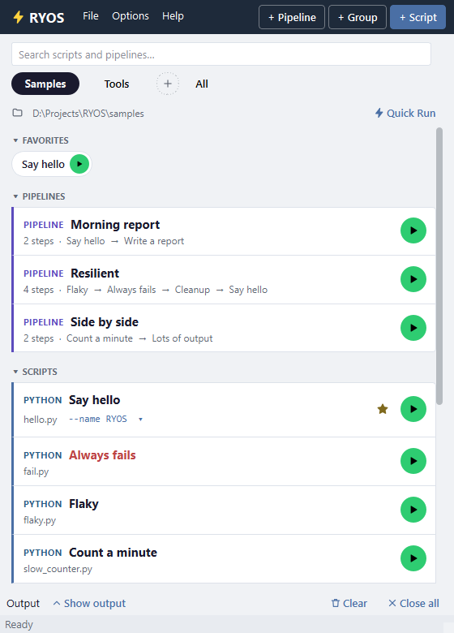

# RYOS — Run Your Own Scripts

A lightweight Windows desktop app for keeping the scripts you run often in one window and running any of them with one click. Save your Python, Node, Bash, PowerShell, Batch — or any executable — once, then press its green play button. No terminal juggling, no remembering paths and arguments.

Built with Python + Qt (PySide6). Ships as a standalone `.exe` (no Python required on the target machine) or runs straight from source.



## Contents

- [Features](#features)
- [Getting Started](#getting-started)
- [How to Use](#how-to-use)
- [Supported Script Types](#supported-script-types)
- [Building the Executable](#building-the-executable)
- [Architecture](#architecture)
- [Documentation](#documentation)

## Features

- **One-click list** — every script is a row with a round green play button, its kind, and how its last run went (**● OK** / **● Failed**). After a failure it turns red: Retry. Edit and run-with-parameters wait under the pointer and in the right-click menu.
- **Favorites** — star what you run most; it gets a pill in a strip at the top.
- **Groups** — pills across the top, each with its own base folder; rename, clone, export or reorder them.
- **Pipelines** — chain scripts in order, run steps side by side, and decide per step whether a failure stops the pipeline, how many retries it gets, and whether it runs only after a failure (clean-up) or only if nothing failed.
- **Parameter presets** — save argument sets per script and pick one from the row before running; or have RYOS ask each run.
- **Schedules and run history** — run anything every N minutes, daily or on chosen days, with catch-up rules; look back at every run.
- **Quick Run** — type a filename (with suggestions) to run any script in a group's folder without adding it first.
- **Maximised layout** — maximise the window and the list moves left while the chosen script or pipeline, its presets, steps and output fill the right.
- **Tabbed output** — live output per run, **errors in red**, find, errors-only, copy or save any tab.
- **Drag & drop** — drop script files on the window to add them; drag rows to reorder or onto a group to move them.
- **Command line** — `ryos-cli list`, `run` and `pipeline` run any script or pipeline from a terminal, Task Scheduler or a git hook, with JSON output and meaningful exit codes.
- **AI agents (MCP)** — let Claude Code, Claude Desktop or another MCP client run the scripts you tick **Available to agents**, with their own parameters or a saved preset, and read the output.
- **Tray, notifications, updates** — keep running in the tray, a Windows toast when a run finishes, and a check for new releases.
- **Themes** — one set of drawn icons that follows the theme; Light and Dark built in, a theme creator (7 colours + live preview), import/export, and more in the [theme gallery](theme-gallery/GALLERY.md). Every colour follows the theme and is checked for contrast.
- **Multi-monitor aware** — opens on the monitor under the cursor; at login, on the last screen you used.

## Which download?

| Download | What's in it | For |
| --- | --- | --- |
| **RYOS-windows.zip** | `RYOS.exe` (the app) and `ryos-cli.exe` (the command line). No AI agents | Most people |
| **RYOS-windows-ai.zip** | The same, plus the MCP server so Claude can run the scripts you choose (`ryos-cli.exe mcp`) | The app with AI agents — see [The command line and AI agents](docs/tutorial/13-command-line-and-agents.md) |
| **RYOS-agent.zip** | `ryos-cli.exe` alone, no window | Letting Claude run an allow-list of your scripts without the app — see [RYOS Agent](docs/tutorial/14-ryos-agent.md) |
| **RYOS-portable.zip** | The source, run with `uv` | Running from source |

Every download keeps your data in the same place, so you can start with one and move to another; each one's update notice names its own zip.

## Getting Started

**Option A — Standalone exe** (no Python needed)

Download the latest release, unzip, and run:

```
RYOS.exe
```

`ryos-cli.exe` in the same folder is the command line (`ryos-cli list`, `ryos-cli run <script>`).

Your scripts and settings live in `%APPDATA%\RYOS` (`scripts.db`, `settings.json`, logs), so replacing the exe with a newer one keeps them.

**Option B — Run from source** (requires [uv](https://docs.astral.sh/uv/getting-started/installation/))

```bash
uv run ryos
```

or double-click `run.bat`. `uv` provisions Python ≥3.10 in an isolated environment, installs the lone dependency (`PySide6`, the Qt toolkit), and launches the app — no manual `pip install` or virtualenv needed. If `uv` isn't installed, run `install_uv.bat` or follow the [uv install guide](https://docs.astral.sh/uv/getting-started/installation/).

## How to Use

The **[illustrated user guide](docs/tutorial/README.md)** walks through every screen with real screenshots. In short:

| To… | Do this | Guide |
|-----|---------|-------|
| Add a script | **+ Script**, or drop the file on the window | [Adding a script](docs/tutorial/02-adding-a-script.md) |
| Run it | Click its green play button; **Show output** to read what it printed | [Running](docs/tutorial/03-running-and-output.md) |
| Edit it | Point at the row and click the pencil, or right-click → **Edit…** | [The main window](docs/tutorial/01-main-window.md) |
| Organise | **+ Group**; drag rows onto a group's pill; right-click a pill for rename, base folder, export | [Groups](docs/tutorial/04-groups.md) |
| Pass arguments | Parameters and **+ Preset** in the script dialog; pick a preset on the row | [Parameters and presets](docs/tutorial/05-parameters-and-presets.md) |
| Chain scripts | **+ Pipeline**, add steps, set what happens on failure | [Pipelines](docs/tutorial/06-pipelines.md) |
| Run on a timer | Right-click → **Schedule…** | [Schedules and history](docs/tutorial/07-schedules-and-history.md) |
| Run a file by name | **Quick Run** (groups with a base folder) | [Quick Run](docs/tutorial/08-quick-run.md) |
| Back up / move | **File → Export all groups…** / **Import config…** | [Import and export](docs/tutorial/10-import-export.md) |
| Change settings and look | **Options → Options…** and **Appearance…** | [Settings](docs/tutorial/11-settings.md) |
| Run from a terminal | `ryos-cli run <script>` (from source: `uv run ryos run <script>`) | [The command line and AI agents](docs/tutorial/13-command-line-and-agents.md) |
| Let an AI agent run scripts | Tick **Available to agents**, then connect Claude to `ryos mcp` | [The command line and AI agents](docs/tutorial/13-command-line-and-agents.md) |

## Supported Script Types

| Extension | Interpreter |
|-----------|-------------|
| `.py` | Python |
| `.js` | node |
| `.ts` | ts-node |
| `.rb` | ruby |
| `.pl` | perl |
| `.php` | php |
| `.sh` | bash |
| `.ps1` | powershell |
| `.bat` `.cmd` `.exe` | run directly |

Leave **Interpreter** blank for auto-detection, or type any custom command to run anything else.

## Building the Executable

The primary packager is **cx_Freeze** (produces a folder you distribute or zip):

```bash
uv run --extra mcp --with cx_Freeze python setup_cxfreeze.py build_exe
# or double-click build.bat
```

Output: `dist/cxfreeze/` containing `RYOS.exe` plus the required DLLs — distribute the whole folder (or zip it).

## Architecture

Qt (PySide6) desktop app organized as the `ryos/` package. Entry point is `ryos.__main__:main`, exposed as the `ryos` console-script.

| Concern | Module |
|---------|--------|
| Paths, settings load/save | `ryos/settings.py` |
| Windows "run at login" registry | `ryos/startup.py` |
| Toast + GitHub update check | `ryos/notifications.py` |
| `ScriptDB` (all SQLite logic) | `ryos/db.py` |
| `detect_interpreter`, `build_command` | `ryos/interpreter.py` |
| Logging utility | `ryos/logger.py` |
| Window, dialogs, cards, tray, start-up (Qt) | `ryos/qtui/*` |

Execution runs in a `threading.Thread`; output is piped through a `queue.Queue` and drained by a `QTimer` on the UI thread every 80 ms, so the worker never touches a widget directly.

## Documentation

- [Illustrated user guide](docs/tutorial/README.md) — a 14-page walkthrough with real screenshots of every screen.
- [Theme gallery](theme-gallery/GALLERY.md) — preview and download extra themes.
- [Architecture](docs/ARCHITECTURE.md) — module map, threading model, data flow.
- [Module reference](docs/API_REFERENCE.md) — public API of the core modules.
- [Contributing](docs/CONTRIBUTING.md) — dev setup, conventions, build steps.
- [Tech debt](TECH_DEBT.md) — known rough edges.
