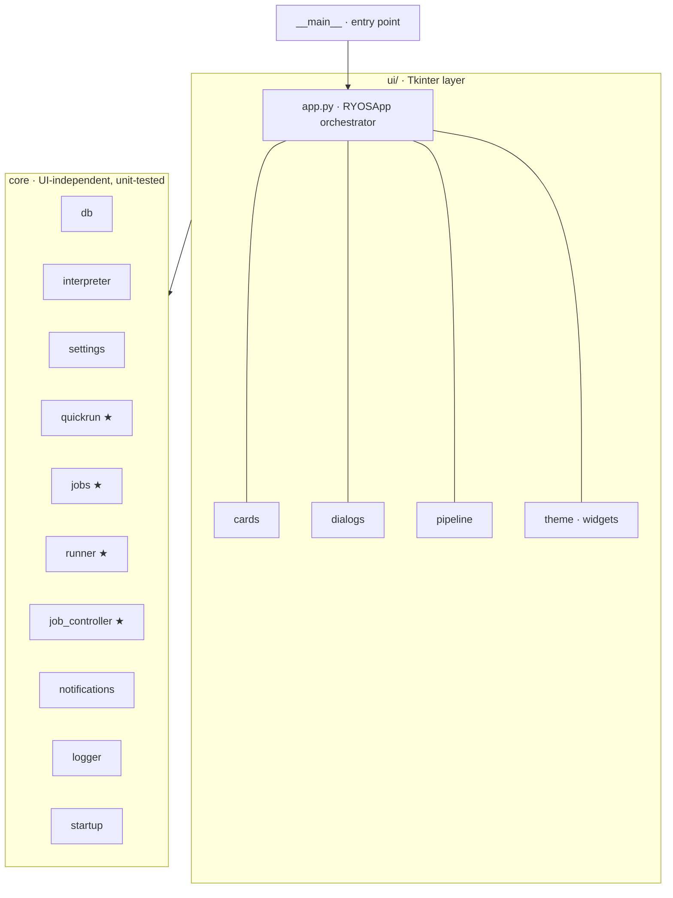

# RYOS architecture

A small Tkinter desktop app for running your own scripts. The codebase is
organised in two layers: a thin Tkinter UI on top, and a UI-independent core
underneath. Dependencies point one way — **downward** — so the core knows
nothing about Tkinter and can be unit-tested without a display.



`★` marks subsystems extracted out of the `app.py` god-class so their logic
could be tested in isolation.

## Modules

| Module | Responsibility | Unit-tested |
| --- | --- | --- |
| `ryos/__main__.py` | Console entry point (`ryos` script → `main`). Loads settings, configures logging, installs the excepthook, then runs `RYOSApp().mainloop()`. | — |
| `ryos/ui/app.py` | `RYOSApp` — the window, job lifecycle, output panel, tabs, drag-and-drop, Quick Run bar. Orchestrates everything. | indirectly |
| `ryos/ui/cards.py` | `ScriptCard`, `PipelineCard` row widgets, plus card-size / compact-mode metrics. | — |
| `ryos/ui/dialogs.py` | Add/edit script, group, base-dir, preset and param-picker dialogs, and the tabbed Advanced Options dialog (Appearance / Startup & Window / Output / Quick Run / Logging). | — |
| `ryos/ui/pipeline.py` | `PipelineEditorDialog`. | — |
| `ryos/ui/theme.py`, `widgets.py` | Palette, flat-button factory, ttk styles, snap-to-corner, tooltip, scrolling label. | — |
| `ryos/db.py` | `ScriptDB` — all SQLite: scripts, groups, pipelines, presets, export/import, `PRAGMA user_version` migrations. | yes |
| `ryos/quickrun.py` | Pure Quick Run helpers: path-containment guard, file-index entry shape, suggestion ranking, name resolution, input parsing. | yes |
| `ryos/jobs.py` | `Job` state container, `JobRegistry` (storage + id allocation), `format_elapsed` time label. | yes |
| `ryos/runner.py` | Subprocess execution worker (`run_subprocess`) and output-queue protocol decoding (`decode_output_item` / `OutputAction`). UI-free; talks to the app only via the queue. | yes |
| `ryos/job_controller.py` | `JobController` — pipeline sequencing (`run_next_pipeline_step`) and step completion (`handle_step_done`). UI-free; reaches the window only through injected callbacks. See `docs/adr/0001`. | yes |
| `ryos/interpreter.py` | Extension→interpreter detection, command building, working-directory selection, RYOS.exe self-relaunch guard. | yes |
| `ryos/settings.py` | App-data paths, defaults, tolerant load/save. | yes |
| `ryos/notifications.py` | Windows toast + GitHub update check (`_parse_version`, `_fetch_latest_release`). | partial |
| `ryos/logger.py` | Rotating-file logger setup for the `ryos` namespace, plus a global excepthook. | — |
| `ryos/startup.py` | Windows "run at login" registry entry. | — |

## Threading and the output queue

Scripts must never block the UI, so execution happens off the main thread:

1. The user clicks **Run**. `RYOSApp` allocates a `Job` (via `JobRegistry`),
   builds the command with `interpreter.build_command()`, and starts a
   `threading.Thread` running `runner.run_subprocess(...)`.
2. The worker thread launches the process with `subprocess.Popen`, then reads
   its combined stdout/stderr line by line, pushing each line onto a shared
   `queue.Queue` as a small tuple.
3. The main UI thread runs a recurring `after(80, ...)` timer
   (`_drain_output_queue`). Each tick drains pending items, turns each into an
   `OutputAction` via `runner.decode_output_item()`, and appends text to the
   correct output tab — **the worker never touches a Tk widget**.

The queue protocol (defined in `runner.py`) is a tuple keyed by its first
element:

| Item | Meaning |
| --- | --- |
| `("stdout", job_id, line)` | A line of normal output. |
| `("stderr", job_id, line)` | A line shown in red (e.g. launch-failure detail). |
| `("done", job_id, script_id, "error", message)` | Launch failed — no process was created. |
| `("done_tag", job_id, script_id, status, tag, footer)` | Process finished; `status` is `ok`/`error`, footer carries the exit code. |

`Stop` calls `.terminate()` (then `.kill()`) on the `Job.current_process`
stored by the worker.

## Data flow: running a script

```
Run click
   → RYOSApp._run_script(script_id, …)
   → interpreter.resolve_interpreter() + build_command()
   → JobRegistry.new_id() / Job(...)
   → Thread(target=runner.run_subprocess, args=(queue, job, cmd, …))
        worker: Popen → stream lines → queue.put(...)
   → RYOSApp._drain_output_queue()  (after-timer on UI thread)
        runner.decode_output_item() → _append_output() / _handle_step_done()
   → on completion: db.mark_run_status(), notifications, card badge update
```

Pipelines reuse the same machinery: a pipeline `Job` carries a `pipeline_queue`
of remaining steps; when one step's `done_tag` arrives, `_run_next_pipeline_step`
launches the next, stopping early if a step exits non-zero.

## Where data lives

`settings.py` resolves a per-user data directory and creates it on import:

- Windows: `%APPDATA%\RYOS`
- Other OSes: `~/.local/share/RYOS`

| File / dir | Contents |
| --- | --- |
| `scripts.db` | SQLite: scripts, groups, pipelines, steps, param presets. |
| `settings.json` | All app settings (tolerant load — corrupt/missing falls back to defaults). |
| `logs/ryos.log` | Rotating log (1 MiB × 3 backups). |
| `qr_index/` | Cached Quick Run file indexes per base directory. |

On first run after an upgrade, `settings.py` migrates a legacy `scripts.db` /
`settings.json` sitting next to the exe into this directory.

## Key design choices

The core modules (`quickrun`, `jobs`, `interpreter`, `settings`, `db`,
`runner`) import no UI. `jobs.py` even keeps its Tk-typed fields as lazy
annotations (`from __future__ import annotations`) so it stays import-clean.
This is what makes the test suite possible without a display:
`tests/test_ryos.py` mocks `tkinter` and exercises the core directly.

- **Interpreter detection** is a single extension→command map in
  `detect_interpreter()`; users override it with a custom-interpreter field,
  resolved by `resolve_interpreter()`.
- **Parameter parsing** uses `shlex.split(params, posix=(os.name != "nt"))` so
  Windows backslash paths survive.
- **Frozen-build guard**: when packaged, `sys.executable` is `RYOS.exe`; running
  a `.py` would relaunch the app, so `_find_python()` / `resolve_interpreter()`
  fall back to a real Python on `PATH`.
- **Schema migrations**: `_ensure_baseline()` brings any old database up to the
  v1 schema; numbered entries in `_MIGRATIONS` run once each, gated by SQLite's
  `PRAGMA user_version`.

## Running and testing

```bash
uv run ryos                                  # launch the app
uv run --no-project --with pytest pytest -q  # run the test suite (tkinter is mocked)
uvx ruff check .                             # lint
```

CI (`.github/workflows/ci.yml`) runs ruff and pytest on every push/PR across
Ubuntu + Windows × Python 3.10/3.13. See `TECH_DEBT.md` for known rough edges
and `docs/CONTRIBUTING.md` for the development workflow.
