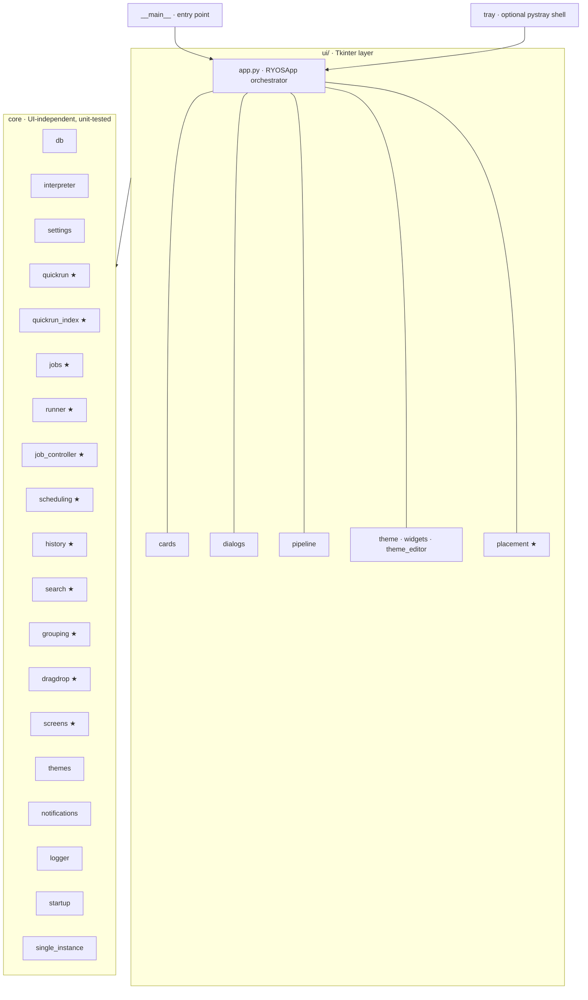

# RYOS architecture

A small Tkinter desktop app for running your own scripts. The codebase is
organised in two layers: a thin Tkinter UI on top, and a UI-independent core
underneath. Dependencies point one way — **downward** — so the core knows
nothing about Tkinter and can be unit-tested without a display.



`★` marks subsystems extracted out of the `app.py` god-class so their logic
could be tested in isolation.

## Modules

| Module | Responsibility | Unit-tested |
| --- | --- | --- |
| `ryos/__main__.py` | Console entry point (`ryos` script → `main`). Loads settings, configures logging, installs the excepthook, then runs `RYOSApp().mainloop()`. | — |
| `ryos/ui/app.py` | `RYOSApp` — the window, job lifecycle, output panel, tabs, drag-and-drop, Quick Run bar. Orchestrates everything. | indirectly |
| `ryos/ui/cards.py` | `ScriptCard`, `PipelineCard` row widgets, plus card-size / compact-mode metrics. | — |
| `ryos/ui/dialogs.py` | Add/edit script, group, base-dir, preset and param-picker dialogs, and the tabbed Advanced Options dialog (Appearance / Startup & Window / Output / Quick Run / Logging). | — |
| `ryos/ui/pipeline.py` | `PipelineEditorDialog`. | — |
| `ryos/ui/theme.py`, `widgets.py` | Palette, flat-button factory, ttk styles, snap-to-corner, tooltip, scrolling label. | — |
| `ryos/db.py` | `ScriptDB` — all SQLite: scripts, groups, pipelines, presets, export/import, `PRAGMA user_version` migrations. | yes |
| `ryos/quickrun.py` | Pure Quick Run helpers: path-containment guard, file-index entry shape, suggestion ranking, name resolution, input parsing. | yes |
| `ryos/quickrun_index.py` | The Quick Run file index: in-memory cache, on-disk cache, single-flight background rebuild. UI-free — the caller injects a `schedule` function for the thread hop, so the same controller works under Tk's `after(0, ...)` or Qt's `QTimer.singleShot`. | yes |
| `ryos/quickrun_actions.py` | What submitting the Quick Run bar does: `plan_submit` parses and resolves the typed text (run, choose between several matches, or say why not), and `ensure_script` reuses or registers the script — keeping saved parameters unless new ones were typed, and remembering typed ones as a preset exactly once. Shared by both bars. | yes |
| `ryos/jobs.py` | `Job` state container, `JobRegistry` (storage + id allocation), `format_elapsed` time label. | yes |
| `ryos/runner.py` | Subprocess execution worker (`run_subprocess`) and output-queue protocol decoding (`decode_output_item` / `OutputAction`). UI-free; talks to the app only via the queue. | yes |
| `ryos/job_controller.py` | `JobController` — pipeline sequencing (`run_next_pipeline_step`) and step completion (`handle_step_done`). UI-free; reaches the window only through injected callbacks. See `docs/adr/0001`. | yes |
| `ryos/interpreter.py` | Extension→interpreter detection, command building, working-directory selection, RYOS.exe self-relaunch guard. | yes |
| `ryos/settings.py` | App-data paths, defaults, tolerant load/save. | yes |
| `ryos/notifications.py` | Windows toast + GitHub update check (`_parse_version`, `_fetch_latest_release`). | partial |
| `ryos/logger.py` | Rotating-file logger setup for the `ryos` namespace, plus a global excepthook. | — |
| `ryos/startup.py` | Windows "run at login" registry entry. | — |
| `ryos/scheduling.py` | Recurring schedules as pure functions over naive local time: `normalize_spec`, `next_occurrence`, `preview`, `resolve_due`, `describe_spec`. Interval / daily / weekly, with a catch-up policy for time the app spent closed. | yes |
| `ryos/history.py` | Formatting for the run-history view — `parse_stamp`, `format_when`, `format_duration`, `format_status`, `describe`, `summarize`. No storage; `db.list_runs()` supplies the rows. | yes |
| `ryos/search.py` | Card search: query parsing and match ranking over scripts, pipelines and groups. | yes |
| `ryos/grouping.py` | Group ordering, collapse state, and the rules for moving an item between groups. Also the group-menu decisions both UIs share: `rename_target` (a clash is refused, since names are unique in the database), and `base_dir_change` / `apply_base_dir_change` (what to confirm and what to report when a group's folder changes). | yes |
| `ryos/dragdrop.py` | Where a dragged card lands — index maths and the legality of a drop, separated from Tk's drag events. | yes |
| `ryos/screens.py` | Pure monitor geometry: `clamp_to_work_area`, `center_on_rect`, `anchored_position` (flip, then clamp). Knows nothing about Tk or Win32. | yes |
| `ryos/marquee.py` | Scroll arithmetic for a marquee label — when to scroll, one step, how long to wait, steps per pass. Shared by the Tk and Qt `ScrollingLabel` so the two cannot animate differently. Pure: no widget, no timer. | yes |
| `ryos/cardmenu.py` | The right-click menus on cards and group tabs, as data (`script_menu`, `pipeline_menu`, `group_menu`, each a list of `MenuItem` with an action key), plus delete prompts and the database side of the actions that need no dialog: favourite, highlight, move, clone, delete. Tk and Qt only map keys to handlers. | yes |
| `ryos/cardstyle.py` | Card layout metrics (padding and row spacing by compact × size) and the Run/Retry and status-chip rules. Returns palette **keys**, not colours, so the Tk and Qt cards resolve one rule through their own palettes. | yes |
| `ryos/verdict.py` | One shape for "can this proceed, and if not what do I tell the user" — kind, title, message, severity. Three modules had grown their own copy; this is where the wording and severity conventions stay in step. | yes |
| `ryos/scriptform.py` | Validation for the add/edit-script form. Three outcomes, not two: a path that does not exist yet is a *question* ("save anyway?") rather than a refusal, because the file may not be written yet. Pure — `path_exists` is passed in, so tests never touch the filesystem. | yes |
| `ryos/themeform.py` | Theme-editor rules: the colour labels, which colour an advanced row shows when nothing is overridden, and the naming check (compared case-insensitively, since two themes differing only in case collide on disk on Windows). | yes |
| `ryos/settings_schema.py` | Declarative description of the 32 user-facing settings — kind, label, tab, bounds — plus `coerce()`, which turns a form's raw text into a usable value and never raises. Replaces five hand-written `try/except ValueError` blocks, and records what an empty box means, which used to be implicit in an `or` guard. | yes |
| `ryos/pipelinesteps.py` | How a pipeline step reads in the editor (row label, policy marks) and what reordering does. Shared by the Tk and Qt editors; reads step rows defensively by length, so an older row shows fewer marks rather than raising. | yes |
| `ryos/outputpanel.py` | Where a line of output goes (its job's tab, the "all" mirror, or nowhere) and when the buffer is trimmed. A job whose tab was closed still reaches the mirror, so closing the tab of a running job does not discard the rest of its output. | yes |
| `ryos/schedule_runner.py` | Firing due schedules, the sweep both UIs run on a timer: `run_due` disables an unusable spec or a missing target, respects the job cap, never stacks a run on one still going, and always advances `next_run_at`. The caller supplies capacity, running and launch callbacks. `pipeline_name` finds ungrouped pipelines too. | yes |
| `ryos/configio.py` | What Export, Import and Delete All ask and report: titles, default file names, the import-mode question, status lines, and a Delete All prompt counted from the database, since that is what `delete_all` removes. Shared by both UIs. | yes |
| `ryos/traypolicy.py` | The tray and the window's life, without pystray: the tooltip (`tray_title`) and menu (`tray_menu`) for a running-job snapshot, and what closing, minimising, starting minimised, quitting and a second launch each do. `tray.py` (pystray) and `qtui/tray.py` (`QSystemTrayIcon`) draw the same menu from it. | yes |
| `ryos/selection.py` | Select mode's wording and decisions: the bar text, Select / Deselect All, `plan_run` (resolve the job cap once, so going past it gives one notice with counts rather than one refusal per script), and the delete prompt. Shared by the Tk and Qt select bars. | yes |
| `ryos/scheduleform.py` | The schedule dialog's form rules: which fields make up a spec per mode, how a stored schedule loads back (tolerating one that no longer parses, since the dialog is how it gets repaired), the catch-up labels, preview formatting, and when to offer starting RYOS at login. The maths stays in `scheduling.py`. | yes |
| `ryos/ui/placement.py` | Applies `screens.py` to real windows — `work_area_for_widget`, `center_over_parent`, `place_near`. Uses Win32 `MonitorFromPoint` / `GetMonitorInfoW` where available, with a documented Tk-only fallback. This is what keeps dialogs on the monitor the app is on. | yes |
| `ryos/qtui/` | The PySide6 front-end, built alongside `ryos/ui/` and not yet shipping (docs/plans/qt-migration.md). `stylesheet.py` turns a palette into one Qt stylesheet — pure, no Qt import, so it is unit-tested in the main suite; whether the CSS reaches real widgets is checked by `tests/qt_smoke.py`. PySide6 is optional: nothing else imports this package. | yes |
| `ryos/themes.py` | The built-in theme gallery and WCAG `contrast_ratio()`, used to keep generated colours legible. | yes |
| `ryos/ui/theme_editor.py` | Dialog for editing and previewing a custom theme. | — |
| `ryos/tray.py` | System-tray icon: tooltip and dynamic menu listing what is currently running. `pystray` is optional — every entry point is guarded so the app runs without it, and CI exercises that path. | partial |
| `ryos/single_instance.py` | Single-instance guard; a second launch hands its arguments to the running window and exits 0. `RYOS_ALLOW_MULTIPLE=1` bypasses it (the release smoke test needs this). | yes |

## Threading and the output queue

Scripts must never block the UI, so execution happens off the main thread:

1. The user clicks **Run**. `RYOSApp` allocates a `Job` (via `JobRegistry`),
   builds the command with `interpreter.build_command()`, and starts a
   `threading.Thread` running `runner.run_subprocess(...)`.
2. The worker thread launches the process with `subprocess.Popen`, then reads
   its combined stdout/stderr line by line, pushing each line onto a shared
   `queue.Queue` as a small tuple.
3. The main UI thread runs a recurring `after(80, ...)` timer
   (`_drain_output_queue`). Each tick drains pending items, turns each into an
   `OutputAction` via `runner.decode_output_item()`, and appends text to the
   correct output tab — **the worker never touches a Tk widget**.

The queue protocol (defined in `runner.py`) is a tuple keyed by its first
element:

| Item | Meaning |
| --- | --- |
| `("stdout", job_id, line)` | A line of normal output. |
| `("stderr", job_id, line)` | A line shown in red (e.g. launch-failure detail). |
| `("done", job_id, script_id, "error", message)` | Launch failed — no process was created. |
| `("done_tag", job_id, script_id, status, tag, footer)` | Process finished; `status` is `ok`/`error`, footer carries the exit code. |

A job can have several steps running at once, so handles live in
`Job.processes` (`step_token -> Popen`). `Stop` clears the remaining queue and
walks `job.active_processes()`, calling `.terminate()` on each live handle.
`Job.current_process` remains for the single-step path only.

## Data flow: running a script

```
Run click
   → RYOSApp._run_script(script_id, …)
   → interpreter.resolve_interpreter() + build_command()
   → JobRegistry.new_id() / Job(...)
   → Thread(target=runner.run_subprocess, args=(queue, job, cmd, …))
        worker: Popen → stream lines → queue.put(...)
   → RYOSApp._drain_output_queue()  (after-timer on UI thread)
        runner.decode_output_item() → _append_output() / _handle_step_done()
   → on completion: db.mark_run_status(), notifications, card badge update
```

Pipelines reuse the same machinery, with `JobController` owning the sequencing.
A pipeline `Job` carries a `pipeline_queue` of remaining steps;
`run_next_pipeline_step` launches the head, and `handle_step_done` settles a
step and decides what happens next. Four things make that more than a loop:

- **Concurrent groups.** Steps marked "run with previous" start together and are
  tracked in `job.group_pending` by token; the group settles when the set empties.
- **Failure policy.** Each step carries `on_failure` (stop or continue) and a
  retry count. Two separate flags distinguish *something failed*
  (`pipeline_failed`) from *the run is winding down* (`pipeline_stopping`), so a
  cleanup step can still run after a failure.
- **Conditional steps.** A step's `run_when` (`always` / `on_success` /
  `on_failure`) is evaluated **lazily, at the head of the queue** — not up front.
  Evaluating the whole queue in advance would drop an `on_failure` cleanup step
  before the failure it exists to handle.
- **Launcher steps.** A step whose script is marked `detached` opens something
  and keeps running. `release_launcher_step` settles it through the normal
  completion path and *then* records the token in `job.released_steps`; the
  order matters, and a late real completion for a released token is ignored.

Whatever path is taken, the queue is settled before asking "is there more?" —
skipping every remaining step must still reach a terminal state, or the job
hangs in Running forever.

## Where data lives

`settings.py` resolves a per-user data directory and creates it on import:

- Windows: `%APPDATA%\RYOS`
- Other OSes: `~/.local/share/RYOS`

| File / dir | Contents |
| --- | --- |
| `scripts.db` | SQLite: scripts, groups, pipelines, pipeline steps, param presets, run history (`runs`), schedules. |
| `settings.json` | All app settings (tolerant load — corrupt/missing falls back to defaults). |
| `logs/ryos.log` | Rotating log (1 MiB × 3 backups). |
| `qr_index/` | Cached Quick Run file indexes per base directory. |

On first run after an upgrade, `settings.py` migrates a legacy `scripts.db` /
`settings.json` sitting next to the exe into this directory.

## Key design choices

The core modules (`quickrun`, `jobs`, `interpreter`, `settings`, `db`,
`runner`) import no UI. `jobs.py` even keeps its Tk-typed fields as lazy
annotations (`from __future__ import annotations`) so it stays import-clean.
This is what makes the test suite possible without a display:
`tests/test_ryos.py` mocks `tkinter` and exercises the core directly.

- **Interpreter detection** is a single extension→command map in
  `detect_interpreter()`; users override it with a custom-interpreter field,
  resolved by `resolve_interpreter()`.
- **Parameter parsing** uses `shlex.split(params, posix=(os.name != "nt"))` so
  Windows backslash paths survive.
- **Frozen-build guard**: when packaged, `sys.executable` is `RYOS.exe`; running
  a `.py` would relaunch the app, so `_find_python()` / `resolve_interpreter()`
  fall back to a real Python on `PATH`.
- **Schema migrations**: `_ensure_baseline()` brings any old database up to the
  v1 schema and is **frozen** — it is not where new schema goes. Numbered
  entries in `_MIGRATIONS` run once each, gated by SQLite's `PRAGMA
  user_version`, and each re-checks `PRAGMA table_info` so it is safe to run
  twice. The schema is at v7; `SCHEMA_VERSION` is derived from the migration
  keys rather than written down separately.
- **Widening an accessor row is a breaking change**: `db.get()` and
  `list_pipeline_steps()` are unpacked positionally in the UI, and appending a
  column has broken those call sites three separate times — twice in shipped
  builds. Call sites slice to a fixed width (`rec[:7]`, `row[:8]`), and
  `TestRowWidthsArePinned` pins the widths so the next widening fails a test
  rather than a user's window.

## Running and testing

```bash
uv run ryos                                  # launch the app
uv run --no-project --with pytest pytest -q  # run the test suite (tkinter is mocked)
uv run python tests/gui_smoke.py             # real-Tk smoke checks (needs a display)
uvx ruff check .                             # lint
```

`tests/qt_smoke.py` is the Qt equivalent of the Tk smoke below. It exits 0
with a notice when PySide6 is absent, so CI and the ordinary test run are
unaffected:

```bash
uv run --no-project --with PySide6 python tests/qt_smoke.py
```

`tests/gui_smoke.py` builds real widgets and asserts on geometry — it catches
the layout regressions the mocked suite cannot see. Synthetic input does not
work in every environment (`event_generate` can be inert and
`wait_visibility()` can hang), so the checks call `.invoke()` and the handlers
directly rather than faking clicks.

One CI trap worth knowing: `--no-project` still resolves against a local
`.venv`, so a dependency present locally can be absent on CI and the documented
command will not reproduce the failure. That is how the tray tests passed
locally while CI sat red for five commits.

CI (`.github/workflows/ci.yml`) runs ruff and pytest on every push/PR across
Ubuntu + Windows × Python 3.10/3.13. See `docs/tech-debt-2026-09-21.md` for known rough edges
and `docs/CONTRIBUTING.md` for the development workflow.
