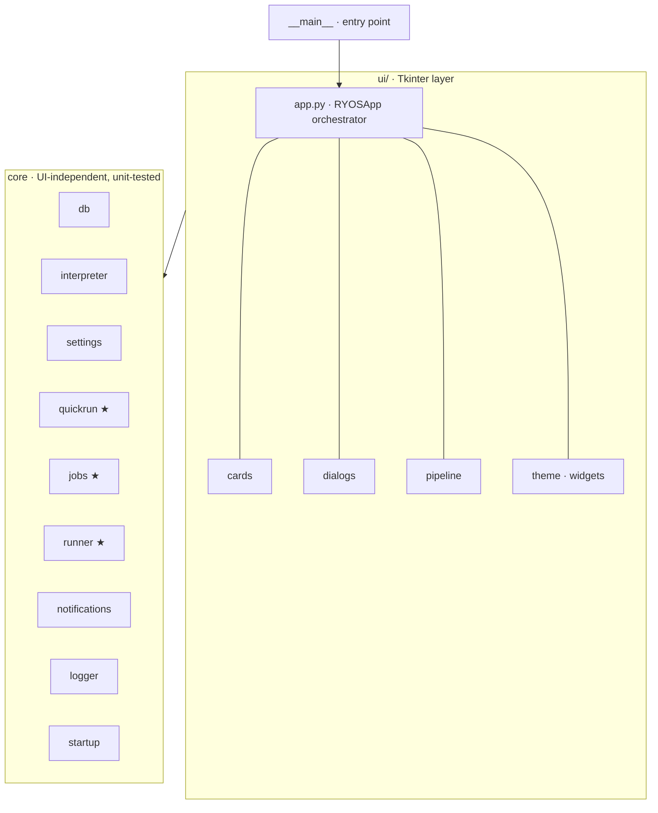

# RYOS architecture

A small Tkinter desktop app for running your own scripts. The codebase is
organised in two layers: a thin Tkinter UI on top, and a UI-independent core
underneath. Dependencies point one way — **downward** — so the core knows
nothing about Tkinter and can be unit-tested without a display.



`★` marks subsystems extracted out of the `app.py` god-class so their logic
could be tested in isolation.

## Modules

| Module | Responsibility | Unit-tested |
| --- | --- | --- |
| `ryos/__main__.py` | Console entry point (`ryos` script → `main`). | — |
| `ryos/ui/app.py` | `RYOSApp` — the window, job lifecycle, output panel, tabs. Orchestrates everything. | indirectly |
| `ryos/ui/cards.py` | `ScriptCard`, `PipelineCard` row widgets. | — |
| `ryos/ui/dialogs.py` | Add/edit script, presets, and the tabbed Advanced Options dialog (Appearance / Startup & Window / Output / Logging). | — |
| `ryos/ui/pipeline.py` | `PipelineEditorDialog`. | — |
| `ryos/ui/theme.py`, `widgets.py` | Palette, flat-button factory, snap-to-corner, tooltip. | — |
| `ryos/db.py` | `ScriptDB` — all SQLite: scripts, groups, pipelines, presets, export/import, `PRAGMA user_version` migrations. | yes |
| `ryos/quickrun.py` | Pure Quick Run helpers: path-containment guard, file-index entry shape, suggestion ranking, name resolution, input parsing. | yes |
| `ryos/jobs.py` | `Job` state container, `JobRegistry` (storage + id allocation), `format_elapsed` time label. | yes |
| `ryos/runner.py` | Subprocess execution worker (`run_subprocess`) and output-queue protocol decoding (`decode_output_item`). UI-free; talks to the app only via the queue. | yes |
| `ryos/interpreter.py` | Extension→interpreter detection, command building, working-directory selection, RYOS.exe self-relaunch guard. | yes |
| `ryos/settings.py` | App-data paths, defaults, tolerant load/save. | yes |
| `ryos/notifications.py` | Windows toast + GitHub update check (`_parse_version`). | partial |
| `ryos/logger.py` | Rotating-file logger setup for the `ryos` namespace. | — |
| `ryos/startup.py` | Windows "run at login" registry entry. | — |

## Key design choices

Execution runs in a `threading.Thread`; output is fed through a `queue.Queue`
and drained by a recurring `after(80, ...)` timer on the main UI thread — the
worker never touches the `Text` widget directly.

The core modules (`quickrun`, `jobs`, `interpreter`, `settings`, `db`) import no
UI. `jobs.py` even carries Tk-typed fields as lazy annotations
(`from __future__ import annotations`) so it stays import-clean. This is what
makes the test suite possible without a display: `tests/test_ryos.py` mocks
`tkinter` and exercises the core directly.

## Running and testing

```bash
uv run ryos                       # launch the app
uv run --with pytest pytest -q    # run the test suite (tkinter is mocked)
uvx ruff check .                  # lint
```

CI (`.github/workflows/ci.yml`) runs ruff and pytest on every push/PR across
Ubuntu + Windows × Python 3.10/3.13. See `TECH_DEBT.