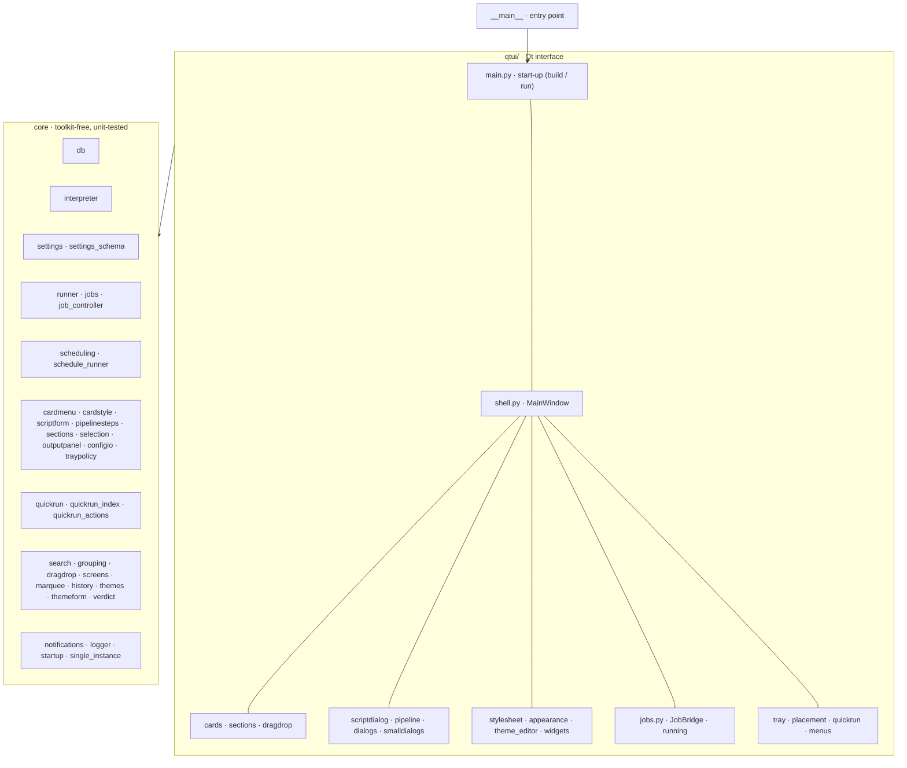

# RYOS architecture

A small Qt (PySide6) desktop app for running your own scripts. The codebase is
organised in two layers: the interface in `ryos/qtui/` on top, and a
toolkit-free core underneath. Dependencies point one way — **downward** — so
the core knows nothing about Qt and can be unit-tested without a display.


```mermaid
flowchart TD
    main["__main__ · entry point"] --> qtmain

    subgraph ui["qtui/ · Qt interface"]
        qtmain["main.py · start-up (build / run)"]
        shell["shell.py · MainWindow"]
        cards["cards · sections · dragdrop"]
        dialogs["scriptdialog · pipeline · dialogs · smalldialogs"]
        look["stylesheet · appearance · theme_editor · widgets"]
        bridge["jobs.py · JobBridge · running"]
        tray["tray · placement · quickrun · menus"]
        qtmain --- shell
        shell --- cards
        shell --- dialogs
        shell --- look
        shell --- bridge
        shell --- tray
    end

    subgraph core["core · toolkit-free, unit-tested"]
        db["db"]
        interpreter["interpreter"]
        settings["settings · settings_schema"]
        run["runner · jobs · job_controller"]
        sched["scheduling · schedule_runner"]
        rules["cardmenu · cardstyle · scriptform · pipelinesteps · sections · selection · outputpanel · configio · traypolicy"]
        quickrun["quickrun · quickrun_index · quickrun_actions"]
        misc["search · grouping · dragdrop · screens · marquee · history · themes · themeform · verdict"]
        infra["notifications · logger · startup · single_instance"]
    end

    ui --> core
```

The core holds the **rules** — what a menu offers, what a card shows, what a
form accepts, how a pipeline proceeds — and the Qt code draws them. Most of
these rules were extracted from the original Tk interface (removed in
September 2026; see `docs/plans/qt-migration.md`) so they could be tested
without a display, and that is still where new logic belongs.

## Modules

### The core

| Module | Responsibility | Unit-tested |
| --- | --- | --- |
| `ryos/__main__.py` | Console entry point (`ryos` script → `main`). Loads settings, configures logging, installs the excepthook, takes the single-instance lock, then runs `qtui.main.run()`. Exits with a message if PySide6 cannot be imported. | — |
| `ryos/db.py` | `ScriptDB` — all SQLite: scripts, groups, pipelines, presets, run history, schedules, export/import, `PRAGMA user_version` migrations. | yes |
| `ryos/quickrun.py` | Pure Quick Run helpers: path-containment guard, file-index entry shape, suggestion ranking, name resolution, input parsing. | yes |
| `ryos/quickrun_index.py` | The Quick Run file index: in-memory cache, on-disk cache, single-flight background rebuild. UI-free — the caller injects a `schedule` function for the thread hop. | yes |
| `ryos/quickrun_actions.py` | What submitting the Quick Run bar does: `plan_submit` parses and resolves the typed text (run, choose between several matches, or say why not), and `ensure_script` reuses or registers the script — keeping saved parameters unless new ones were typed, and remembering typed ones as a preset exactly once. | yes |
| `ryos/jobs.py` | `Job` state container, `JobRegistry` (storage + id allocation), `format_elapsed` time label. | yes |
| `ryos/runner.py` | Subprocess execution worker (`run_subprocess`) and output-queue protocol decoding (`decode_output_item` / `OutputAction`). UI-free; talks to the app only via the queue. | yes |
| `ryos/job_controller.py` | `JobController` — launch planning, pipeline sequencing (`run_next_pipeline_step`) and step completion (`handle_step_done`). UI-free; reaches the window only through injected callbacks. See `docs/adr/0001`. | yes |
| `ryos/interpreter.py` | Extension→interpreter detection, command building, working-directory selection, RYOS.exe self-relaunch guard. | yes |
| `ryos/settings.py` | App-data paths, defaults, tolerant load/save. | yes |
| `ryos/settings_schema.py` | Declarative description of the 31 settings the Options dialog shows — kind, label, tab, bounds, per-item tidying — plus `coerce()`, which turns a form's raw text into a usable value and never raises. The Options dialog is generated from it. | yes |
| `ryos/notifications.py` | Windows toast + GitHub update check (`_parse_version`, `_fetch_latest_release`), and what a check's result means (`update_status`). | partial |
| `ryos/logger.py` | Rotating-file logger setup for the `ryos` namespace, plus a global excepthook. | — |
| `ryos/startup.py` | Windows "run at login" registry entry. `RYOS_NO_REGISTRY=1` blocks writes (the smokes set it). | — |
| `ryos/scheduling.py` | Recurring schedules as pure functions over naive local time: `normalize_spec`, `next_occurrence`, `preview`, `resolve_due`, `describe_spec`. Interval / daily / weekly, with a catch-up policy for time the app spent closed. | yes |
| `ryos/schedule_runner.py` | Firing due schedules: `run_due` disables an unusable spec or a missing target, respects the job cap, never stacks a run on one still going, and always advances `next_run_at`. The caller supplies capacity, running and launch callbacks. | yes |
| `ryos/history.py` | Formatting for the run-history view, and pruning old runs at start-up. No storage; `db.list_runs()` supplies the rows. | yes |
| `ryos/search.py` | Card search: query parsing and match ranking over scripts, pipelines and groups. | yes |
| `ryos/grouping.py` | Group ordering, the last group remembered, and the group-menu decisions: `rename_target` (a clash is refused, since names are unique in the database), and `base_dir_change` / `apply_base_dir_change`. | yes |
| `ryos/dragdrop.py` | Where a dragged card lands — index maths, the legality of a drop, and the database side (`apply_move`, `apply_reorder`). | yes |
| `ryos/screens.py` | Pure monitor geometry: `clamp_to_work_area`, `center_on_rect`, `anchored_position`, the initial window geometry and snap position. Knows nothing about Qt. | yes |
| `ryos/marquee.py` | Scroll arithmetic for the marquee card name — when to scroll, one step, how long to wait. Pure: no widget, no timer. | yes |
| `ryos/cardmenu.py` | The right-click menus on cards and group tabs, as data (`script_menu`, `pipeline_menu`, `group_menu`, each a list of `MenuItem` with an action key), plus delete prompts and the database side of the actions that need no dialog. The window only maps keys to handlers. | yes |
| `ryos/cardstyle.py` | What a card shows: layout metrics by compact × size, the Run/Retry and status-chip rules, badges, the path relative to the group's folder, the last-run time and a pipeline's step summary. Returns palette **keys**, not colours. | yes |
| `ryos/verdict.py` | One shape for "can this proceed, and if not what do I tell the user" — kind, title, message, severity. | yes |
| `ryos/scriptform.py` | The add/edit-script form: load and save, validation (a path that does not exist yet is a *question*, not a refusal), presets, what the card's parameter drop-down offers, file drops. Pure — `path_exists` is passed in. | yes |
| `ryos/themeform.py` | Theme-editor rules: the colour labels, which colour an advanced row shows when nothing is overridden, and the naming check (case-insensitive, since two themes differing only in case collide on disk on Windows). | yes |
| `ryos/pipelinesteps.py` | How a pipeline step reads in the editor (row label, policy marks) and what reordering does; reads step rows defensively by length. | yes |
| `ryos/outputpanel.py` | Where a line of output goes (its job's tab, the "all" mirror, or nowhere), when the buffer is trimmed, and the panel's wording. | yes |
| `ryos/configio.py` | What Export, Import and Delete All ask and report, including a Delete All prompt counted from the database. | yes |
| `ryos/traypolicy.py` | The tray and the window's life: the tooltip (`tray_title`) and menu (`tray_menu`) for a running-job snapshot, and what closing, minimising, starting minimised, quitting and a second launch each do. | yes |
| `ryos/sections.py` | A group's sections (Favorites, Pipelines, Scripts): which records go where, the header and empty-section texts, the All tab's blocks, and a per-group `CollapseState` for the session. | yes |
| `ryos/selection.py` | Select mode's wording and decisions: the bar text, Select / Deselect All, `plan_run` (resolve the job cap once), and the delete prompt. | yes |
| `ryos/detail.py` | The maximised layout: when the list and the detail pane go side by side (`use_workspace`), and what the pane says -- the Run/Retry label, the line under the name, and the facts it lists. | yes |
| `ryos/scheduleform.py` | The schedule dialog's form rules: which fields make up a spec per mode, how a stored schedule loads back, the catch-up labels, preview formatting, and when to offer starting RYOS at login. | yes |
| `ryos/themes.py` | The theme gallery, palette building, custom themes, highlight colours and WCAG `contrast_ratio()` / `ink_on()`, used to keep every colour legible. | yes |
| `ryos/single_instance.py` | Single-instance guard; a second launch asks the running window to restore and exits. `RYOS_ALLOW_MULTIPLE=1` bypasses it. | yes |

### The Qt interface (`ryos/qtui/`)

Nothing but `__main__` imports this package, and it may import any core
module. Real effects (saving settings, toasts, the update check, run-at-login,
the log, quitting) are passed into the window and do nothing by default, so a
test can build windows freely; `main.py` is the one place that passes the
real ones.

| Module | Responsibility |
| --- | --- |
| `main.py` | Start-up: `build()` does everything short of the event loop (themes, database, window, job bridge, tray, placement, update check) and returns `(app, window)`; `run()` adds the loop. |
| `shell.py` | `MainWindow`: tabs, sections, search, select mode, menus, the output panel, placement, the tray and close rules. |
| `cards.py`, `sections.py`, `dragdrop.py` | Script and pipeline cards (rows of one panel per section; compact rows are a launcher list), a group's collapsible sections, and drag-and-drop between them and onto tabs. |
| `detail.py` | The maximised layout's detail pane: the chosen item's name, actions, presets, steps and facts, with the output under them. Its buttons press the chosen row's own, so the two cannot drift. |
| `scriptdialog.py`, `pipeline.py`, `dialogs.py`, `smalldialogs.py` | The script dialog, the pipeline editor, the Options dialog (generated from `settings_schema`), and the small ones: new group, base folder, parameters, schedule, run history, close-to-tray. |
| `jobs.py`, `running.py` | `JobBridge` runs jobs through `JobController` and drains the output queue on a `QTimer`; `RunningSection` lists what is running, with Stop. |
| `icons.py` | The one icon set: line icons on a 24-unit grid, drawn from SVG and tinted by colour role from the palette; `IconButton` / `IconLabel` re-tint on a theme change. No font glyph or emoji is used as an icon -- `check_one_icon_set` in `tests/qt_smoke.py` enforces it. |
| `stylesheet.py` | Turns a palette into one Qt stylesheet. Pure — no Qt import — so it is unit-tested in the main suite, including that every text colour it draws is legible in every shipped theme. |
| `appearance.py`, `theme_editor.py` | The Appearance dialog and the custom-theme editor. |
| `quickrun.py`, `menus.py`, `tray.py`, `placement.py`, `widgets.py` | The Quick Run bar, menus from `cardmenu` data, the tray icon, monitor work areas from `QScreen`, and small shared widgets (the marquee label, the elided label). |

## Threading and the output queue

Scripts must never block the UI, so execution happens off the main thread:

1. The user clicks **Run**. `JobBridge` asks `JobController` to plan the launch
   (job cap, missing file, interpreter), allocates a `Job` via `JobRegistry`,
   and starts a `threading.Thread` running `runner.run_subprocess(...)`.
2. The worker thread launches the process with `subprocess.Popen`, then reads
   its combined stdout/stderr line by line, pushing each line onto a shared
   `queue.Queue` as a small tuple.
3. A `QTimer` on the UI thread (every 80 ms) calls `JobController.pump()`,
   which drains pending items, turns each into an `OutputAction` via
   `runner.decode_output_item()`, and emits it to the window — **the worker
   never touches a widget**.

The queue protocol (defined in `runner.py`) is a tuple keyed by its first
element:

| Item | Meaning |
| --- | --- |
| `("stdout", job_id, line)` | A line of normal output. |
| `("stderr", job_id, line)` | A line shown in red (e.g. launch-failure detail). |
| `("done", job_id, script_id, "error", message)` | Launch failed — no process was created. |
| `("done_tag", job_id, script_id, status, tag, footer)` | Process finished; `status` is `ok`/`error`, footer carries the exit code. |

A job can have several steps running at once, so handles live in
`Job.processes` (`step_token -> Popen`). `Stop` clears the remaining queue and
walks `job.active_processes()`, calling `.terminate()` on each live handle.
`Job.current_process` remains for the single-step path only.

## Data flow: running a script

```text
Run click (card) → MainWindow.run_script_card()
   → JobBridge.run_script() → JobController.plan_script()
        interpreter.resolve_interpreter() + build_command()
   → JobRegistry.new_id() / Job(...)
   → Thread(target=runner.run_subprocess, args=(queue, job, spec, …))
        worker: Popen → stream lines → queue.put(...)
   → QTimer → JobController.pump()
        runner.decode_output_item() → output tab / handle_step_done()
   → on completion: db.mark_run_status(), run history, toast,
     the cards' Run buttons and status chips updated in place
```

Pipelines reuse the same machinery, with `JobController` owning the sequencing.
A pipeline `Job` carries a `pipeline_queue` of remaining steps;
`run_next_pipeline_step` launches the head, and `handle_step_done` settles a
step and decides what happens next. Four things make that more than a loop:

- **Concurrent groups.** Steps marked "run with previous" start together and are
  tracked in `job.group_pending` by token; the group settles when the set empties.
- **Failure policy.** Each step carries `on_failure` (stop or continue) and a
  retry count. Two separate flags distinguish *something failed*
  (`pipeline_failed`) from *the run is winding down* (`pipeline_stopping`), so a
  cleanup step can still run after a failure.
- **Conditional steps.** A step's `run_when` (`always` / `on_success` /
  `on_failure`) is evaluated **lazily, at the head of the queue** — not up front.
  Evaluating the whole queue in advance would drop an `on_failure` cleanup step
  before the failure it exists to handle.
- **Launcher steps.** A step whose script is marked `detached` opens something
  and keeps running. `release_launcher_step` settles it through the normal
  completion path and *then* records the token in `job.released_steps`; the
  order matters, and a late real completion for a released token is ignored.

Whatever path is taken, the queue is settled before asking "is there more?" —
skipping every remaining step must still reach a terminal state, or the job
hangs in Running forever.

## Where data lives

`settings.py` resolves a per-user data directory and creates it on import:

- Windows: `%APPDATA%\RYOS`
- Other OSes: `~/.local/share/RYOS`

| File / dir | Contents |
| --- | --- |
| `scripts.db` | SQLite: scripts, groups, pipelines, pipeline steps, param presets, run history (`runs`), schedules. |
| `settings.json` | All app settings (tolerant load — corrupt/missing falls back to defaults). |
| `logs/ryos.log` | Rotating log (1 MiB × 3 backups). |
| `qr_index/` | Cached Quick Run file indexes per base directory. |
| `themes/` | Custom themes, one JSON file each. |

On first run after an upgrade, `settings.py` migrates a legacy `scripts.db` /
`settings.json` sitting next to the exe into this directory.

## Key design choices

The core modules import no UI toolkit. That is what makes the unit suite
possible without a display: `tests/test_ryos.py` exercises the core directly,
without Qt installed.

- **Interpreter detection** is a single extension→command map in
  `detect_interpreter()`; users override it with a custom-interpreter field,
  resolved by `resolve_interpreter()`. A `.ps1` runs with
  `-ExecutionPolicy Bypass` for that one process, since Windows' default policy
  refuses every script.
- **Parameter parsing** uses `shlex.split(params, posix=(os.name != "nt"))` so
  Windows backslash paths survive.
- **Frozen-build guard**: when packaged, `sys.executable` is `RYOS.exe`; running
  a `.py` would relaunch the app, so `_find_python()` / `resolve_interpreter()`
  fall back to a real Python on `PATH`.
- **Schema migrations**: `_ensure_baseline()` brings any old database up to the
  v1 schema and is **frozen** — it is not where new schema goes. Numbered
  entries in `_MIGRATIONS` run once each, gated by SQLite's `PRAGMA
  user_version`, and each re-checks `PRAGMA table_info` so it is safe to run
  twice. The schema is at v8; `SCHEMA_VERSION` is derived from the migration
  keys rather than written down separately.
- **Widening an accessor row is a breaking change**: `db.get()` and
  `list_pipeline_steps()` are unpacked positionally in the UI, and appending a
  column has broken those call sites three separate times — twice in shipped
  builds. Call sites slice to a fixed width (`rec[:7]`, `row[:8]`), and
  `TestRowWidthsArePinned` pins the widths so the next widening fails a test
  rather than a user's window.

## Running and testing

```bash
uv run ryos                                              # launch the app
uv run --no-project --with pytest pytest -q              # the unit suite (no display, no Qt)
uv run --no-project --with PySide6 python tests/qt_smoke.py   # real Qt widgets, feature by feature
uv run python tests/session_smoke.py                     # a whole working session
uvx ruff check .                                         # lint
uvx mypy --platform linux                                # types (core; scope in pyproject)
```

`tests/qt_smoke.py` builds real widgets and checks each feature, including what
is painted (pixel checks for ticks, gaps and contrast). `tests/session_smoke.py`
drives one realistic session through the real start-up. `tests/launch_smoke.py`
starts the real entry point, from source or the exe, and
`tests/real_data_smoke.py` opens a copy of the user's own data. All of them run
on a throwaway data folder and, with `--visible`, keep their windows on a
second screen. `CLAUDE.md` lists them with their options.

One CI trap worth knowing: `--no-project` still resolves against a local
`.venv`, so a dependency present locally can be absent on CI and the documented
command will not reproduce the failure.

CI (`.github/workflows/ci.yml`) runs ruff and the unit suite on Ubuntu and
Windows × Python 3.10/3.13, mypy, and the Qt, launch and session smokes
offscreen on Ubuntu. See `docs/CONTRIBUTING.md` for the development workflow.
