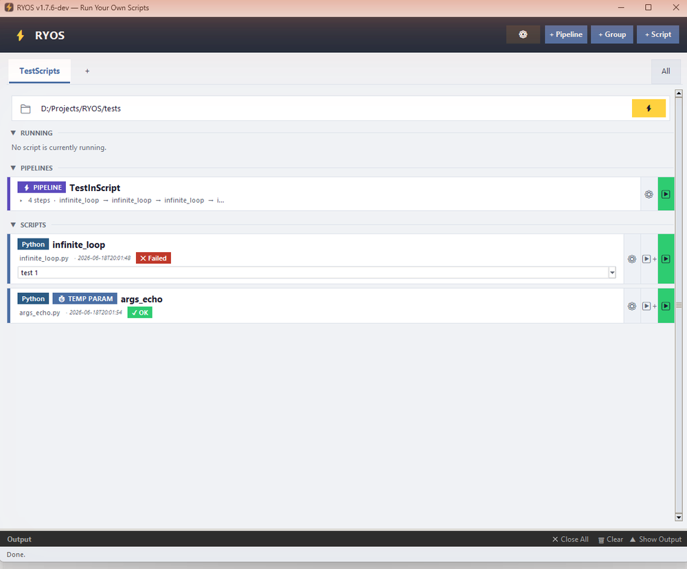

# The main window

When RYOS opens you see a single window. Everything you do lives here, so it's worth a quick tour from top to bottom before you start.

*Screenshot pending — capture the whole window showing the **TestScripts** tab, the Quick Run bar, a pipeline card under **PIPELINES**, two script cards under **SCRIPTS**, and the collapsed **Output** bar at the bottom.*

## The header

Across the very top, on the left, is the ⚡ **RYOS** logo. On the right are the four controls you'll use most:

| Control | What it does |
|---|---|
| **⚙** | Opens the **Options** menu (Select scripts, Export all groups, Import config, Advanced options…, Check for updates, Delete All). |
| **+ Pipeline** | Creates a new pipeline — a sequence of scripts that run in order. |
| **+ Group** | Creates a new group (a tab) to organise your scripts. |
| **+ Script** | Adds a new script card. This is the button you'll use first. |

> Note: these "add" buttons live in the header. (Older documentation described them under an "Options ▾" menu — the live app puts them in the header instead.)

## Group tabs

Just below the header is a row of **group tabs** — here, **TestScripts**. Each tab is a group that holds its own scripts and pipelines. A **+** next to the tabs adds a new group, and **All** on the right shows every group's scripts together.

## The Quick Run bar

Under the tabs is the **Quick Run bar**, showing a folder path (for example `D:/Projects/RYOS/tests`) with a yellow ⚡ button on the right. It lets you type a file name and run it on the spot. The bar only appears when the group has a *base directory* set and Quick Run is enabled — see [The Quick Run bar](07-quick-run.md).

## The three sections

The middle of the window is split into collapsible sections. Click a section's ▼ header to fold or unfold it:

- **RUNNING** — shows whatever script is running right now (or *"No script is currently running."*).
- **PIPELINES** — your pipelines for this group, each as a card.
- **SCRIPTS** — your scripts for this group, each as a card.

## Cards

Every script and pipeline is shown as a **card**. A card displays a type badge (e.g. **Python**), its name, its file name, the last-run time and result (a green **✓ OK** or red **✗ Failed** badge), and a set of action buttons on the right — **⚙ edit**, **▶ run**, and a tall green **▶** to run it.

## The Output panel

At the very bottom is the **Output** bar. It's collapsed by default; click it (or **Show Output**) to expand it and read what your scripts printed. Full details are in [Running a script & the output panel](03-running-and-output.md).

---
[Contents](README.md) · [Next: Adding a script →](02-adding-a-script.md)
