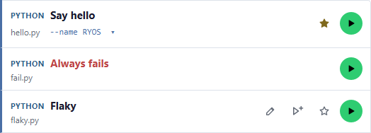
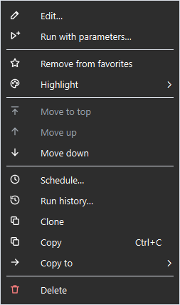

# The main window

Everything in RYOS happens in one window. Here it is with the **Samples** group open, from top to bottom.

## The header

The dark bar at the top holds the menus and the buttons that make new things:

| Control | What it does |
| --- | --- |
| **File** | New script, pipeline or group; import and export; exit. |
| **Options** | Settings, appearance, start with Windows, select mode, Delete All. |
| **Help** | Check for updates. |
| **+ Pipeline** | Create a pipeline: several scripts run in order. |
| **+ Group** | Create a group to keep related scripts together. |
| **+ Script** | Add a script. The blue button, and the one you'll use first. |

## Search and groups

Type in **Search scripts and pipelines…** to show only what matches; the count of matches appears beside the box.

Below it are your **groups**, drawn as pills. The dark pill is the group on screen; click another to switch. The dashed **+** makes a new group, and **All** shows every group at once. See [Groups](04-groups.md).

Under the pills is the group's **folder** (click it to change it) and **⚡ Quick Run** (see [Quick Run](08-quick-run.md)).

## Favorites, pipelines and scripts

The rest of the window is the group's things to run, in three sections. Click a section's **▾** heading to fold it away.

- **FAVORITES** — a strip of small pills for the things you run most, each with its own **▶**.
- **PIPELINES** — scripts chained together, marked **⚡ PIPELINE** with a purple edge.
- **SCRIPTS** — your scripts, marked with their kind (**PYTHON**, **BATCH**, **POWERSHELL**…) and a blue edge.

Each row shows the name, the file (or a pipeline's steps) and, once it has run, how the last run went: **● OK** or **● Failed**. On the right is the round green **▶** that runs it.

## A row's other buttons

A row shows only **▶** (and a gold **★** if it's a favorite) until you point at it. Then its other buttons appear beside Run:

| Button | What it does |
| --- | --- |
| **✎** | Edit the script. |
| **▶ with a +** | Run with different parameters, just this once or saved. |
| **☆ / ★** | Add to or remove from Favorites. |
| **▶** | Run it. After a failed run it turns red and shows **↻**: press it to try again. |

**Right-click** a row for everything else: edit, run with parameters, favorites, a highlight colour for the name, moving it up or down, schedule, run history, clone and delete.

## The Output bar

At the very bottom is the **Output** bar. It stays folded until you want it; see [Running a script and reading its output](03-running-and-output.md).

---
[Contents](README.md) · [Next: Adding a script →](02-adding-a-script.md)
