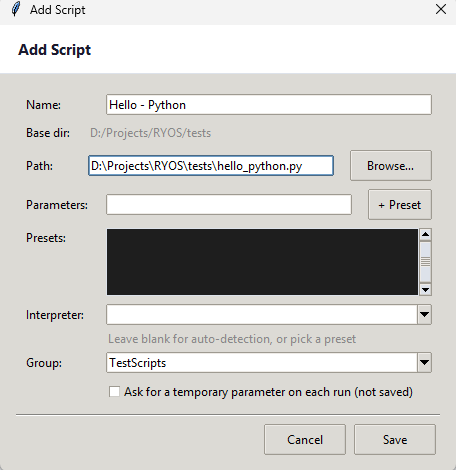
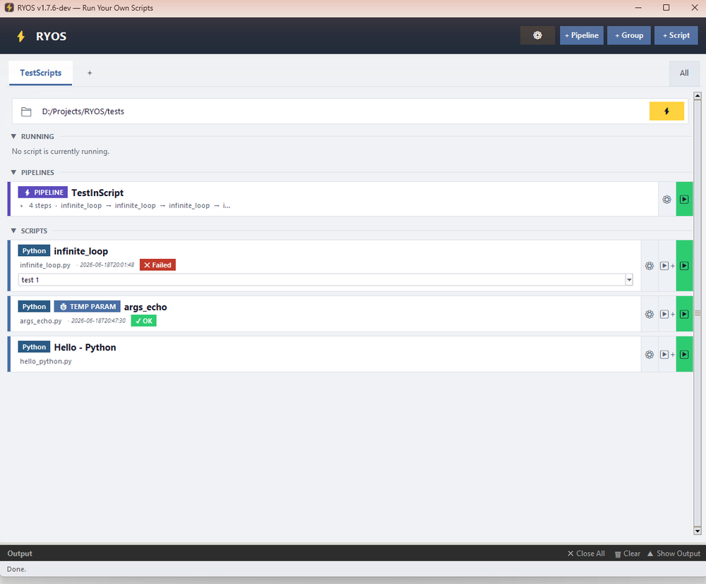

# Adding a script

A *script* is any file you can run — a Python file (`.py`), a batch file (`.bat`/`.cmd`), a PowerShell script (`.ps1`), a shell script (`.sh`), and so on. Saving one as a card means you can run it later with one click.

## Open the Add Script dialog

Click **+ Script** in the header. The **Add Script** dialog opens.

*Screenshot pending — capture the **Add Script** dialog filled in with a believable example: Name "Hello – Python", Path pointing at a `.py` file, Group "TestScripts".*

## Fill in the fields

| Field | What to enter |
|---|---|
| **Name** | A friendly label shown on the card, e.g. *Hello – Python*. |
| **Base dir** | The group's base folder (shown for reference). Paths you pick are relative to it. |
| **Path** | The path to your script file. Type it, or click **Browse…** to pick the file. |
| **Parameters** | *(optional)* Command-line arguments to pass every time it runs. See [Parameters, prompts & presets](05-parameters-and-presets.md). |
| **+ Preset** | *(optional)* Saves the current Parameters as a named **preset** you can pick at run time. |
| **Presets** | *(optional)* The list of presets you've saved for this script. |
| **Interpreter** | *(optional)* Leave blank to let RYOS auto-detect from the file extension, or pick/enter one (e.g. `python`, `node`). |
| **Group** | Which group (tab) to save the script under. |
| **Ask for a temporary parameter on each run (not saved)** | When ticked, RYOS prompts you for one-off arguments every time you run it. The card then shows a **TEMP PARAM** badge. |

## Save it

Click **Save**. The new card appears in the **SCRIPTS** section of the group you chose.

*Screenshot pending — capture the **SCRIPTS** list with the newly added card visible.*

> **Tip:** You can also **drag a script file from File Explorer onto the RYOS window**. RYOS opens the Add Script dialog with the path already filled in.

---
[← The main window](01-main-window.md) · [Contents](README.md) · [Next: Running a script & the output panel →](03-running-and-output.md)
