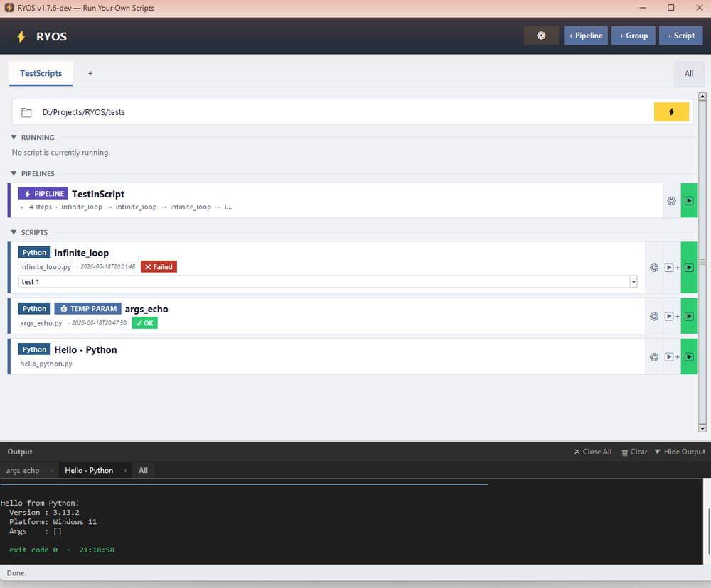

# Running a script & the output panel

Once a script is saved as a card, running it is one click — and everything it prints shows up in the Output panel at the bottom.

## Run a script

Find the script's card and click its green **▶** button on the right. While it runs, the card appears in the **RUNNING** section at the top, and the red **⏹** stop control becomes active so you can cancel it.

When it finishes, the card shows the result: a green **✓ OK** badge if it succeeded (exit code 0) or a red **✗ Failed** badge if it didn't, along with the time of the last run.

## The output panel

Click the **Output** bar at the bottom (or **Show Output**) to expand it. You'll see exactly what the script printed.

*Screenshot pending — capture the expanded **Output** panel after running a short script (e.g. `args_echo`), showing the per-run tab, the echoed command, the output text, and the green `exit code 0` line.*

What you'll see in the panel:

- **Per-run tabs** along the top — one tab per recent run (named after the script), plus an **All** tab that combines them. Each tab has an **✕** to close it.
- **The command line** RYOS actually ran, shown in blue — including the interpreter it chose and any parameters.
- **The program's output** (its normal `stdout`). Anything the program writes to `stderr` appears in **red** so errors stand out.
- **A summary line** in green when it succeeds, e.g. `exit code 0`, with the finish time.

## Output panel controls

The bar at the top of the Output panel has:

| Control | Action |
|---|---|
| **Close All** | Close every run tab and clear the view. |
| **Clear** | Clear the text of the current run. |
| **Hide Output** / **Show Output** | Collapse or expand the panel. |

The status line at the very bottom of the window (e.g. *Ready.* / *Done.*) tells you the app's current state at a glance.

> You can control output behaviour — auto-scrolling, auto-clearing before each run, the maximum number of lines kept, and a completion notification — in **Advanced Options → Output** (see [Advanced Options](09-settings.md)).

---
[← Adding a script](02-adding-a-script.md) · [Contents](README.md) · [Next: Groups →](04-groups.md)
