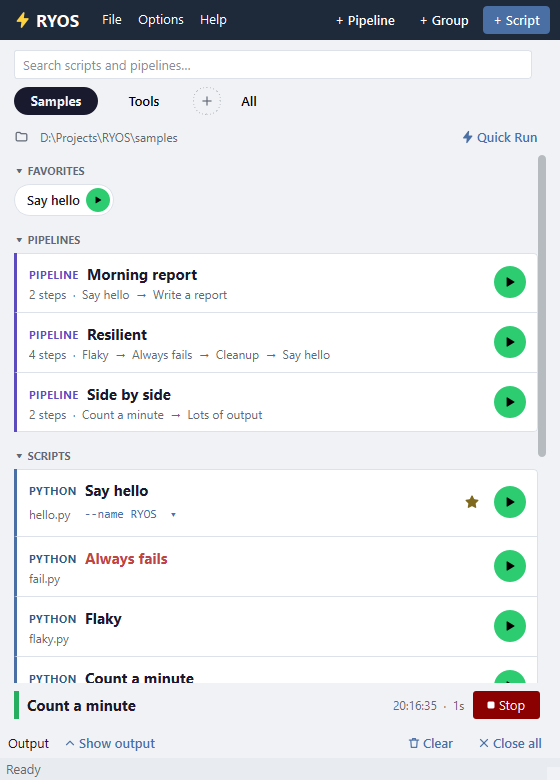
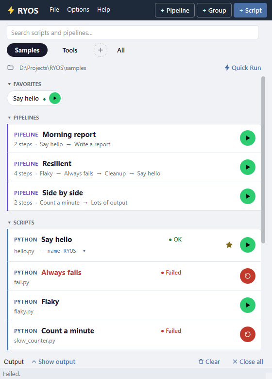
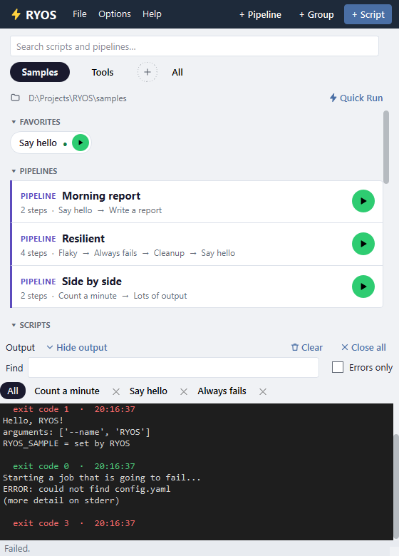

# Running a script and reading its output

## Run it

Click the green play button on a row. While it runs, it appears in the **Running** list just above the Output bar, with the time it started, how long it has been going, and a **Stop** button.

Several scripts can run at once. **Stop** ends one early.

## See how it went

When a run ends, the row says how it went: **● OK**, or **● Failed** with its Run button turned red and showing a circular arrow. Press it to run again.

## Read the output

Click **Show output** at the bottom to open the output panel.

- **A tab per run**, named after the script, and **All**, which shows every run together. Click a tab's cross to close it; right-click a tab to **Copy** its text, **Save** it to a file, or **Close** it.
- **Colours**: what the script prints is light grey, its error output is red, and RYOS's own lines (a step starting, the exit code) are blue and green.
- **Find** highlights matches; press **Enter** for the next one and **Shift+Enter** for the previous. **Errors only** hides everything but the red lines.
- **Clear** empties the tab in front. **Close all** closes every finished tab.
- **Hide output** folds the panel away again.

The line at the very bottom of the window says what RYOS last did: *Ready*, *Done*, *Failed*, *Stopped*.

> In **Options → Options… → Output** you can have the panel open by itself when a run starts, clear it between runs, and get a notification when a run finishes.

---
[← Adding a script](02-adding-a-script.md) · [Contents](README.md) · [Next: Groups →](04-groups.md)
