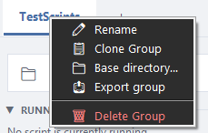

# Groups (tabs)

Groups are the tabs across the top of the window. Each group is a separate collection of scripts and pipelines — a tidy way to keep, say, *Work* scripts apart from *Personal* ones. Each group can also have its own **base directory**, which powers the Quick Run bar.

## Working with groups

| Action | How |
|---|---|
| **Create a group** | Click **+ Group** in the header, or the **+** next to the tabs. |
| **Switch group** | Click its tab. |
| **See everything at once** | Click **All** on the right of the tab row. |
| **Rename a group** | Right-click the tab → **Rename**. |
| **Clone a group** | Right-click the tab → **Clone Group** (copies the group and its contents). |
| **Set a base directory** | Right-click the tab → **Base directory…** (enables Quick Run for that group). |
| **Export a group** | Right-click the tab → **Export group** (saves just that group to a file). |
| **Delete a group** | Right-click the tab → **Delete Group**. |

## The tab menu

Right-click any group tab to open its menu.

*Screenshot pending — capture the group tab right-click menu open over the **TestScripts** tab.*

## Moving scripts between groups

To move a script (or pipeline) into another group, **drag its card onto the target group's tab**. The card hops to that group. You can also reorder cards within a group by dragging them up or down.

---
[← Running a script & the output panel](03-running-and-output.md) · [Contents](README.md) · [Next: Parameters, prompts & presets →](05-parameters-and-presets.md)
