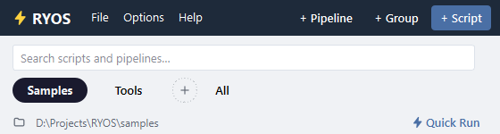
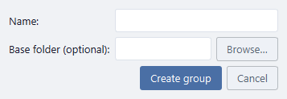
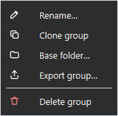

# Groups

A group is a set of scripts and pipelines that belong together — *Work* and *Home*, or one per project. Each group can also have a **base folder**: the folder its scripts live in, which paths are relative to and which [Quick Run](08-quick-run.md) searches.

A script whose file, or working folder, is somewhere else gets an **OUTSIDE FOLDER** tag (a small warning sign on compact rows; point at it to see which part). That's usually a slip, so when you run it RYOS asks first — **Run anyway** or **Cancel** — and the run's output starts with a one-line note. Tick **Don't warn me about this again** in that box, or untick **Options → Output → Warn before running a script outside its group's base folder**, to stop the question; the tag and the note stay. A pipeline gets the tag, and the question, when one of its steps is outside. Scheduled runs never ask.

## Making and switching groups

- **Switch** by clicking a group's pill.
- **Make one** with the dashed **+** after your groups, **+ Group** in the header, or **File → New Group…**. Give it a name and, if you like, a base folder, then click **Create group**.
- **All** shows every group on one page, each under its own heading.

## The group menu

Right-click a group's pill:

| Entry | What it does |
| --- | --- |
| **Rename…** | Give the group a new name. |
| **Paste** | Copy what you copied into this group (see below). Greyed until you copy something. |
| **Clone group** | Copy the group with all its scripts and pipelines. |
| **Base folder…** | Set or change the group's folder (clicking the folder line under the pills does the same). |
| **Export group…** | Save just this group to a file. See [Import and export](10-import-export.md). |
| **Delete group** | Remove the group and what's in it, after asking. |

Drag a pill left or right to change the order of your groups.

## Moving things between groups

Drag a row onto another group's pill to move it there. Drag it up or down within its panel to change its place; a line shows where it will land.

When both groups have a base folder, a moved script follows into the new one: `<old folder>\tools\x.py` becomes `<new folder>\tools\x.py`, and its working folder the same way — but only when that file (or folder) is there. Otherwise it keeps running the file it had, and RYOS says it is outside the new group's folder.

## Copying to another group

To keep the original where it is and put a copy in another group:

- **Copy to.** Right-click the row → **Copy to** → pick the group. Done in one step.
- **Copy and Paste.** Right-click the row → **Copy** (or select the row and press **Ctrl+C**). Then right-click another group's pill → **Paste**, or press **Ctrl+V** on any row in that group. Paste names what it will paste, and you can paste the same thing into several groups.

A copied script keeps everything that defines how it runs — parameters, interpreter, environment, working folder — and its saved presets. Into another group with a base folder, its path and working folder follow into that folder, as a move does. A copied pipeline brings the scripts its steps run, so it works and can be edited in its new group. If that group already has a script that runs exactly the same way, the copy uses it instead of adding a second one.

A copy keeps the star and highlight colour too, but not a schedule or run history: those stay with the original. (**Clone** makes the same kind of copy in the same group, named "… (copy)".)

---
[← Running a script](03-running-and-output.md) · [Contents](README.md) · [Next: Parameters and presets →](05-parameters-and-presets.md)
