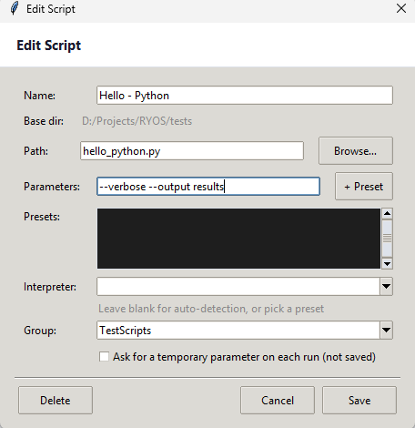
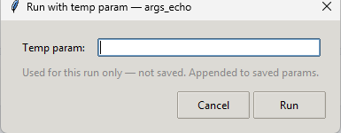

# Parameters, prompts & presets

Many scripts take *arguments* — extra values passed on the command line that change what they do. RYOS gives you three ways to handle them: fixed parameters, named presets, and run-time prompts.

## Fixed parameters

In the **Add/Edit Script** dialog, type your arguments into the **Parameters** field. They're passed to the script every time it runs. Quoting works the way you'd expect, so `--name "My File"` is treated as a single value.

*Screenshot pending — capture the Edit Script dialog with an example in the **Parameters** field, e.g. `hello world`.*

## Presets — saved argument sets

If you run the same script with different arguments, save each set as a named **preset** instead of editing the card every time:

1. In the Add/Edit Script dialog, type the arguments into **Parameters**.
2. Click **+ Preset** and give the set a name.
3. The set is added to the **Presets** list.

Back on the card, scripts with presets show a small **dropdown** where you pick which preset to use before running. One card stays flexible across several common argument sets.

## Run-time prompts (temporary parameters)

Sometimes you want to type an argument fresh each time. Tick **"Ask for a temporary parameter on each run (not saved)"** in the script dialog. The card then carries a **TEMP PARAM** badge, and every time you run it RYOS pops up a small box first.

*Screenshot pending — capture the **Run with temp param** dialog that appears when running a TEMP PARAM script.*

Whatever you type is **used for that run only — not saved**, and is appended to any saved parameters. Click **Run** to go, or **Cancel** to back out.

---
[← Groups](04-groups.md) · [Contents](README.md) · [Next: Pipelines →](06-pipelines.md)
