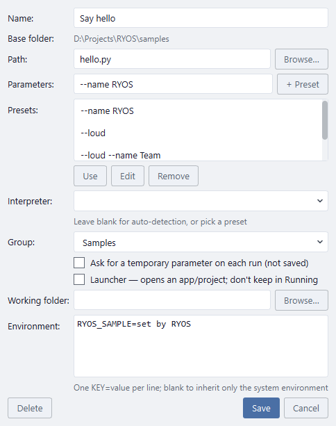
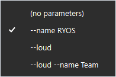
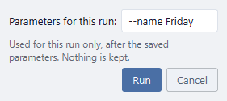

# Parameters and presets

Many scripts take *parameters* — extra words on the command line that change what they do, like `--name RYOS` or `--loud`. RYOS gives you three ways to pass them.

## Saved parameters

Type them into **Parameters** in the script dialog. They're passed on every run. Quoting works as you'd expect: `--title "My report"` is one value.

## Presets: several sets to choose from

If you run a script with a few different sets of parameters, save each as a **preset**: type it into **Parameters** and click **+ Preset**. The **Presets** list below holds them; **Use** puts one back into Parameters, **Edit** changes it, **Remove** deletes it.

A script with presets shows the one Run will use on its row, next to the file name. Click it to pick another:

## Just this once

- **Run with parameters…** — point at a row and click the play-with-a-plus button, or right-click → **Run with parameters…**. Type the parameters and run. They're remembered as the script's parameters and added as a preset.
- **Ask for a temporary parameter on each run** — tick this in the script dialog and RYOS asks for **Parameters for this run** every time you press Run; **Run** goes ahead. What you type is used for that run only and added after the saved parameters; nothing is kept.

---
[← Groups](04-groups.md) · [Contents](README.md) · [Next: Pipelines →](06-pipelines.md)
