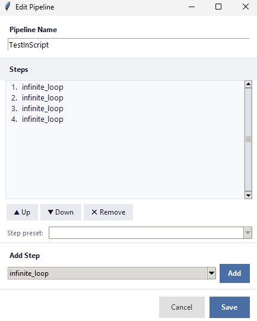

# Pipelines

A **pipeline** runs several scripts one after another, in order. If any step fails, the pipeline stops there — so it's perfect for multi-step routines like *build → test → publish* where each step depends on the one before.

## Create a pipeline

Click **+ Pipeline** in the header, give it a name, and confirm. The pipeline appears as a card in the **PIPELINES** section, and the editor opens so you can add steps.

## Edit a pipeline

Click the **⚙** button on a pipeline card (or right-click it → **Edit**) to open the **Edit Pipeline** dialog.

*Screenshot pending — capture the **Edit Pipeline** dialog with a few steps listed.*

In the editor you can:

- **Add a step** — pick a script from the **Add Step** dropdown and click **Add**. The step joins the bottom of the list.
- **Reorder** — select a step and use **▲ Up** / **▼ Down**.
- **Remove** — select a step and click **✕ Remove**.
- **Step preset** — choose which saved preset a step should run with (for scripts that have presets).

Click **Save** when you're done.

## Run a pipeline

Click the green **▶** on the pipeline card. The Output panel shows each step's progress in turn — you'll see *Step 1/N*, *Step 2/N*, and so on. If a step fails, the pipeline stops and the remaining steps don't run. Click **⏹** to abort a pipeline mid-run.

## Clone a pipeline

Right-click a pipeline card → **Clone** to make an exact copy, including all its steps — handy as a starting point for a similar routine.

---
[← Parameters, prompts & presets](05-parameters-and-presets.md) · [Contents](README.md) · [Next: The Quick Run bar →](07-quick-run.md)
