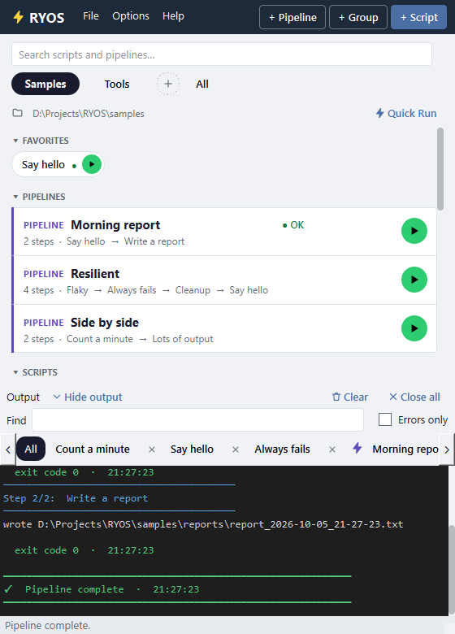

# Pipelines

A **pipeline** runs several scripts one after another: *build, then test, then publish*. By default a failed step stops the pipeline, so later steps never run on a broken result; each step can be told otherwise.

## Make one

Click **+ Pipeline** in the header (or **File → New Pipeline…**), name it, and the editor opens. To change it later, point at its row and click the pencil, or right-click → **Edit…**.

- **Add a step**: pick a script under **Add step** and click **Add**.
- **Order**: select a step and use **Up** / **Down**. **Remove** takes it out.
- **With Prev**: the selected step starts together with the one above it instead of after it. Such steps are marked **∥** in the list.

Select a step to set how it behaves; the list says in words what you've changed:

| Setting | Choices |
| --- | --- |
| **If it fails** | *Stop the pipeline*, or *Keep going*. |
| **Retries** | Run it again up to this many times before calling it failed. |
| **Run this step** | *Always*, *Only if nothing has failed*, or *Only if something has failed* — the last is handy for a clean-up step. |
| **Step preset** | Which of the script's presets this step uses. |

Click **Save** when you're done. **Available to agents**, under the name, lets an AI agent run the pipeline (all its steps); see [The command line and AI agents](13-command-line-and-agents.md).

## Run it

Click the pipeline's play button. The output shows each step as it starts and how it ended, then the pipeline's result:

**Stop** in the Running list ends the whole pipeline. Right-click a pipeline → **Clone** to start a similar one from a copy.

---
[← Parameters and presets](05-parameters-and-presets.md) · [Contents](README.md) · [Next: Schedules and run history →](07-schedules-and-history.md)
