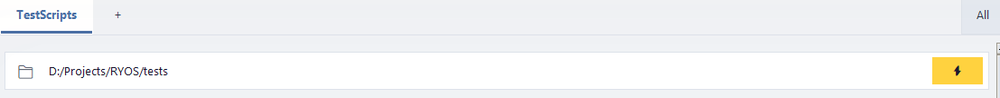

# The Quick Run bar

The **Quick Run bar** lets you run a file by name without first saving it as a card — useful when you just want to fire off a script that lives in a known folder.

## When it appears

The bar sits just under the group tabs and shows the group's **base directory** with a yellow ⚡ button on the right. It only appears when two things are true:

1. The group has a **base directory** set — right-click the group tab → **Base directory…** to set one.
2. **Show Quick Run bar** is enabled in **Advanced Options → Quick Run** (it's on by default).

*Screenshot pending — capture the Quick Run bar at the top of a group, ideally with a file name typed and an autocomplete suggestion showing.*

## Using it

Click into the bar and start typing a file name. If **Show suggestions as you type** is on, RYOS offers matching files from the base directory (and its subfolders) as you go — pick one from the list. Then press the ⚡ button (or Enter) to run it. Output appears in the panel at the bottom, exactly like running a card.

## What gets suggested

RYOS keeps a small index of files under the base directory so suggestions are fast. By default it indexes only runnable script types (`.py`, `.js`, `.ts`, `.sh`, `.ps1`, `.bat`, and similar). You can change which extensions are indexed, cap how many files are indexed, or clear the index cache — all under **Advanced Options → Quick Run** (see [Advanced Options](09-settings.md)).

---
[← Pipelines](06-pipelines.md) · [Contents](README.md) · [Next: Import & export →](08-import-export.md)
