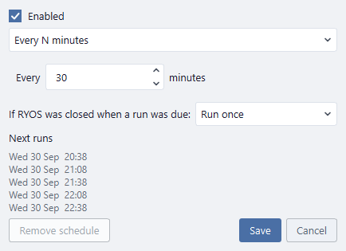
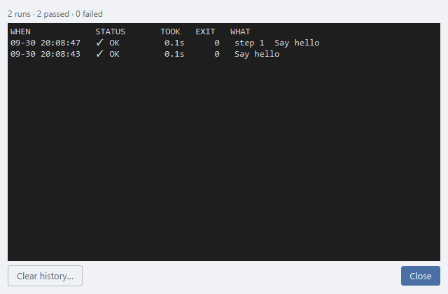

# Schedules and run history

## Run on a schedule

Right-click a script or pipeline → **Schedule…** to have RYOS run it by itself.

- Choose **Every N minutes**, **Every day at** a time, or **On chosen days at** a time.
- **If RYOS was closed when a run was due** decides what happens to runs missed while RYOS was closed: **Run once**, **Skip them**, or **Run every missed one**.
- **Next runs** shows when it will run, so you can check before saving.
- **Enabled** turns the schedule off without deleting it; **Remove schedule** deletes it.

A scheduled row is marked **SCHEDULED**. Schedules only run while RYOS is open — on Windows, saving one offers to start RYOS when you sign in.

## Look back at runs

Right-click → **Run history…** lists every recorded run, newest first: when, how it ended, how long it took, the exit code, and — for a pipeline — which step.

**Clear history…** deletes this script's or pipeline's history, after asking. Old history is trimmed by itself: **Options → Options… → Output → Keep run history for (days)**.

---
[← Pipelines](06-pipelines.md) · [Contents](README.md) · [Next: Quick Run →](08-quick-run.md)
