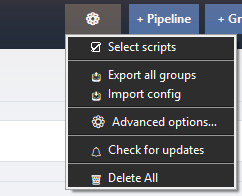

# Import & export

You can save your RYOS setup to a file and load it back later — handy for backups or moving your scripts to another computer. Everything is stored as plain `.json`.

## Export

Open the **⚙** Options menu in the header and choose:

- **Export all groups** — saves a single `.json` file containing every group, script, and pipeline.

To export just one group, **right-click its tab → Export group** instead.

*Screenshot pending — capture the **⚙** Options menu open, with **Export all groups** and **Import config** visible.*

## Import

Open the **⚙** Options menu and choose **Import config**, then pick a previously exported `.json` file. RYOS asks how to bring the contents in:

- **Replace** — replaces the scripts in any groups that appear in the file, and leaves your other groups untouched.
- **Merge** — adds new scripts and skips any whose file path already exists in the group.

Pick whichever fits — *Merge* is the safe choice if you're combining setups and don't want to overwrite anything.

> The Options menu also has **Select scripts** (a checkbox mode for deleting several cards at once), **Check for updates**, and **Delete All**.

---
[← The Quick Run bar](07-quick-run.md) · [Contents](README.md) · [Next: Advanced Options →](09-settings.md)
