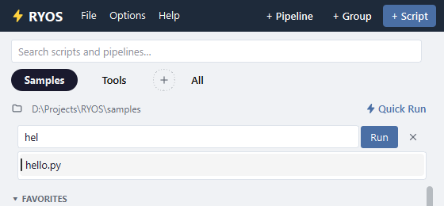

# Quick Run

Quick Run runs any file in the group's folder by typing its name — no need to add it first. It's there for groups with a **base folder** (see [Groups](04-groups.md)).

## Use it

Click **Quick Run** (with the bolt) at the right of the folder line. A box opens; start typing a file name.

- Matching files from the folder and its subfolders are suggested as you type. **↑ / ↓** move through them.
- **Tab** fills in the one picked and leaves room to add parameters: `hello.py --loud`.
- **Enter** (or **Run**) runs it. **Esc** or the cross closes the box.

A file you Quick Run is added to the group as a script, so next time it's a row you can run with one click.

## What it searches

RYOS keeps a small index of the folder so suggestions come fast. **Options → Options… → Quick Run** sets which file types it indexes, how many files at most, how many suggestions to show, and whether to suggest as you type at all.

---
[← Schedules and run history](07-schedules-and-history.md) · [Contents](README.md) · [Next: The maximised layout →](09-maximised-layout.md)
