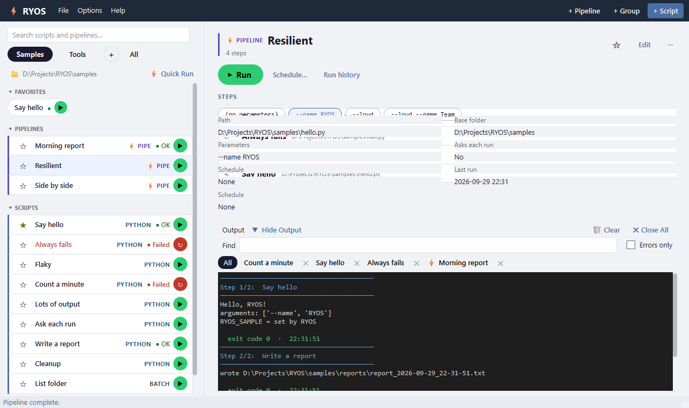

# The maximised layout

Maximise the window (or make it full screen) and RYOS uses the room: the list moves to the left as one-line rows, and whatever you click appears in full on the right, with its output under it. Restore the window and it goes back to the single list.

## What the right side shows

Click a row on the left to show it. At the top are its kind and name, the star, **Edit** and **⋯** (the row's right-click menu). Under that:

- **▶ Run** — or **↻ Retry** after a failure — with **Run with…**, **Schedule…** and **Run history** beside it.
- **PARAMETERS** — a script's presets as chips; the highlighted one is what Run passes. Click another to switch.
- For a pipeline, its **STEPS** in order.
- A few **facts**: the path, the base folder, the saved parameters, whether it asks each run, its schedule and when it last ran.
- The **output**, which lives here while the window is maximised.

Everything on the right does exactly what the row's own buttons do.

Prefer the single list even when maximised? Turn off **Options → Options… → Cards → Maximised: list on the left, details on the right**.

---
[← Quick Run](08-quick-run.md) · [Contents](README.md) · [Next: Import and export →](10-import-export.md)
