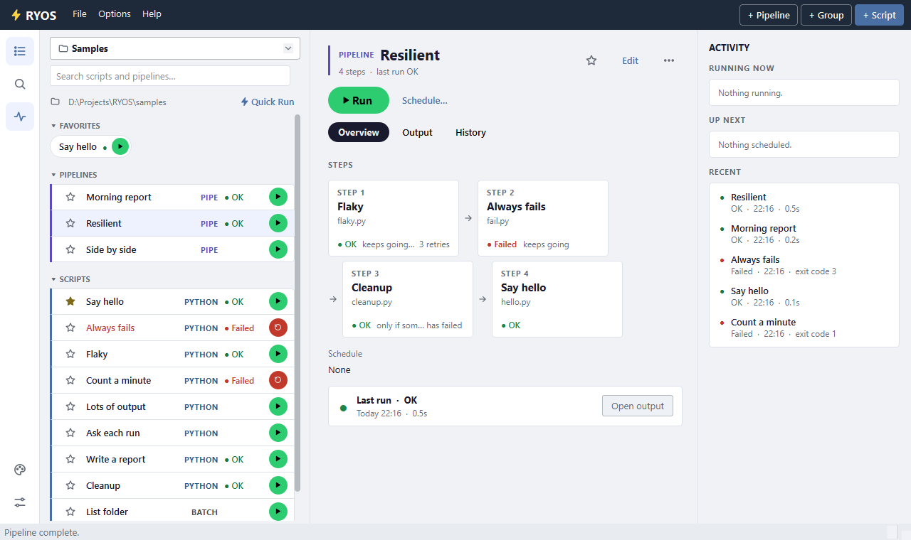

# The maximised layout

Maximise the window (or make it full screen) and RYOS uses the room. Down the left edge is a rail of places; next to it, the list as one-line rows; and whatever you click appears in full on the right, in tabs. Restore the window and it goes back to the single list.

## The rail and the group picker

The rail holds the places in the app: **Library** (back to the list), **Search** (into the search box), **Activity** (shows or hides the Activity bar; a small number on it says how many runs are going), and at its foot **Appearance…** and **Options…**.

While the window is maximised, the group pills give way to a **group picker** over the list. Click it for a menu of your groups, **All** and **New group…**; right-click it to rename or delete the group you are on.

## What the right side shows

Click a row on the left to show it. At the top are its kind and name, the star, **Edit** and the three dots (the row's right-click menu), and **Run** — or **Retry** after a failure — with **Run with…** and **Schedule…** beside it. Under that are three tabs:

- **Overview** — for a script, its presets as pills: the highlighted one is what Run passes (click another to switch), and each pill's own ▶ runs with it straight away. For a pipeline, its **STEPS** as cards in order — an arrow into each step, a + into one that starts with the step before — each with its script's file, how its last run went, and anything set differently from the default (its own parameters, keeps going, retries). Then a few facts, and a **Last run** box: how it went, when and how long it took, with **Open output** while that run's output is still open (otherwise **History**).

- **Output** — the output panel, with a tab per run. When you run the item you are looking at, RYOS switches here for you.
- **History** — its recorded runs, newest first, with **Clear history…**.

Everything on the right does exactly what the row's own buttons do.

## The Activity bar

Down the right edge, **ACTIVITY** keeps an eye on everything at once:

- **RUNNING NOW** — each run in progress, how long it has been going, and its Stop button.
- **UP NEXT** — the next scheduled runs, with when and how often.
- **RECENT** — the last runs, with how they went: **OK** and how long it took, or **Failed** and the exit code. A pipeline stands for its steps.

Click a line under Up next or Recent to show that item on the right — Recent opens its **History** tab. The status bar repeats the gist: how many are running, and what runs next.

Prefer the single list even when maximised? Turn off **Options → Options… → Cards → Maximised: list on the left, details on the right**.

---
[← Quick Run](08-quick-run.md) · [Contents](README.md) · [Next: Import and export →](10-import-export.md)
