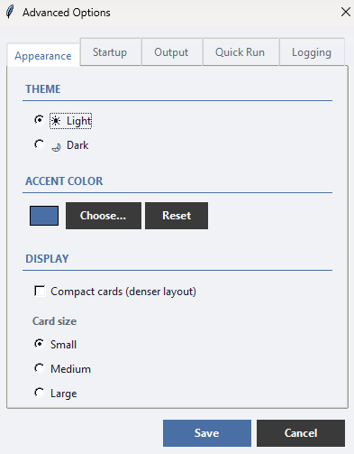
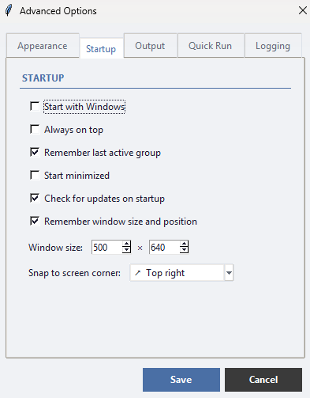

# Advanced Options (settings)

Open **⚙ → Advanced options…** from the header. The settings are organised into five tabs: **Appearance**, **Startup**, **Output**, **Quick Run**, and **Logging**. Change what you like, then click **Save** (or **Cancel** to discard).

## Appearance

*Screenshot pending — capture the **Appearance** tab.*

- **Theme** — pick from the dropdown. **Light** and **Dark** ship with the app; more (Nord, Solarized, High Contrast, Sepia, …) live in the [theme gallery](../../theme-gallery/) — download and **Import…** them — and any custom themes you've made appear here too. The window re-themes live as you select.
- **Accent color** — pick a highlight colour with **Choose…**, or **Reset** to the default.
- **Compact cards** — a denser layout that fits more cards on screen.
- **Card size** — **Small**, **Medium**, or **Large**.

### Custom themes

Below the theme dropdown:

- **Create…** opens the theme editor, pre-filled from the current theme. Choose a light or dark **base**, then set the seven core colours (background, cards, borders, header, accent, primary and secondary text). A live **preview** and inline **contrast warnings** help you keep text readable; everything else is derived automatically. Give it a name and **Save**.
- **Advanced (optional)** in the editor exposes ~12 more colours (Run button, error, the terminal panel, neutral buttons, tabs, pipeline accent, and more). Each shows its auto-derived value until you override it; the **↺** button resets one back to auto.
- **Edit…** and **Delete** apply to the selected custom theme (built-ins can't be changed).
- **Export…** saves the selected custom theme to a `.json` file; **Import…** loads one back (name clashes are resolved automatically), so themes are easy to share. Custom themes are stored in `themes.json` in the app's data folder.

## Startup

*Screenshot pending — capture the **Startup** tab.*

- **Start with Windows** — launch RYOS automatically when you sign in.
- **Always on top** — keep the window above other windows.
- **Remember last active group** — reopen on the group you used last.
- **Start minimized** — start hidden in the taskbar.
- **Check for updates on startup** — look for a newer version when the app opens.
- **Remember window size and position** — reopen where you left it.
- **Open on the screen where the cursor is** — on a multi-monitor setup, a manual launch (double-click / `uv run ryos`) opens on the monitor your mouse is on, carrying over the remembered position. When RYOS starts with Windows at login, it instead reopens on the last screen you used. Turn this off to always reopen on the last screen.
- **Window size** — set a fixed width × height.
- **Snap to screen corner** — pin the window to a chosen corner of the screen (the same monitor it opens on).

## Output

- **Auto-clear output before each run** — start each run with a clean panel.
- **Auto-scroll to bottom** — keep the newest output in view.
- **Notify when script / pipeline completes** — show a notification when a run finishes.
- **Max output lines** — how many lines to keep before trimming the oldest.
- **Max parallel jobs (0 = unlimited)** — how many scripts may run at once.

## Quick Run

- **Show Quick Run bar** — show the bar (requires a group base directory).
- **Show suggestions as you type** — offer file-name autocomplete.
- **Index file types** — which extensions the file index includes (empty = index everything); add or remove extensions in the list.
- **Index max files (0 = unlimited)** — a cap so a huge folder can't build an oversized index.
- **Clear index cache** — rebuild the suggestion index from scratch.

## Logging

The **Logging** tab controls the app's own diagnostic log (whether logging is on, the level of detail, and whether to record each run's output) — useful mainly for troubleshooting.

---
[← Import & export](08-import-export.md) · [Contents](README.md) · [Next: Tips & shortcuts →](10-tips.md)
