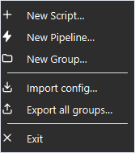

# Import and export

Save your setup to a file and load it back — for a backup, or to move to another computer. The file is plain `.json`.

## Export

- **File → Export all groups…** saves every group, script and pipeline to one file.
- To save just one group, right-click its pill → **Export group…**.

## Import

**File → Import config…**, then pick a file you exported. RYOS asks how to bring it in:

- **Yes = Replace** — the groups in the file replace the groups of the same name. Your other groups are left alone.
- **No = Merge** — adds what's new and skips anything already there (the same file path, or the same pipeline name).

When in doubt, choose **Merge**: it never overwrites anything.

> Script paths are stored as they were on the computer that exported them. On a new computer, set each group's **Base folder…** to where the files now live and RYOS remaps the paths under it.

---
[← The maximised layout](09-maximised-layout.md) · [Contents](README.md) · [Next: Settings and appearance →](11-settings.md)
