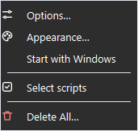
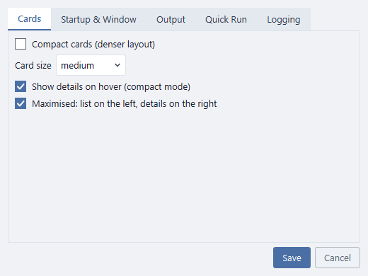
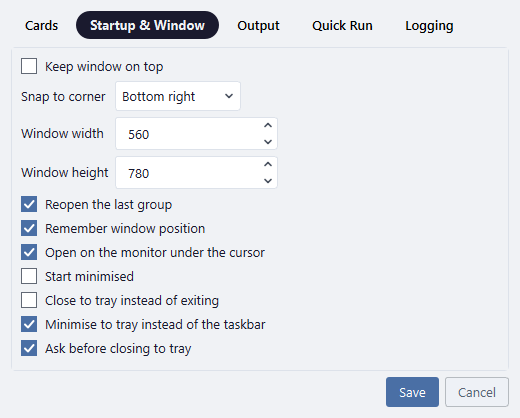
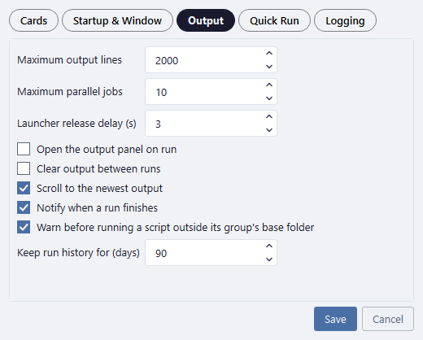
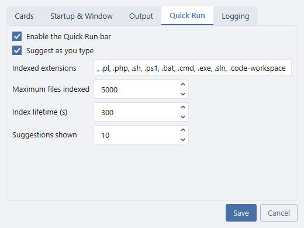
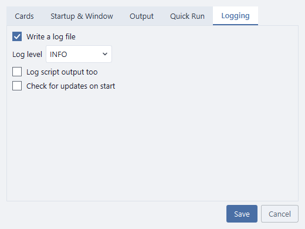
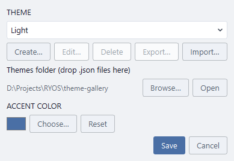

# Settings and appearance

The **Options** menu holds the settings, the look, and a few switches:

| Entry | What it does |
| --- | --- |
| **Options…** | The settings below. |
| **Appearance…** | Themes and the accent colour. |
| **Start with Windows** | Start RYOS when you sign in (needed for schedules to run). |
| **Select scripts** | Tick several scripts to run or delete them together. See [Tips](12-tips.md). |
| **Delete All…** | Remove every group, script and pipeline, after asking. Export first if you might want them back. |

## Options…

Settings are grouped in tabs. Change what you like and click **Save**.

**Cards**

- **Compact cards** — one line per row. See [Tips](12-tips.md).
- **Card size** — small, medium or large rows.
- **Show details on hover (compact mode)** — pointing at a compact row shows its path and parameters.
- **Maximised: list on the left, details on the right** — see [The maximised layout](09-maximised-layout.md).

**Startup & Window**

Where the window opens and how big, whether it stays on top, whether it reopens the last group, and whether closing it keeps RYOS running in the system tray (so schedules keep firing).

**Output**

How much output to keep, how many scripts may run at once, whether the panel opens and clears by itself, notifications, and how long run history is kept.

**Quick Run**

Whether the Quick Run bar is offered, what it indexes and how many suggestions it shows. See [Quick Run](08-quick-run.md).

**Logging**

RYOS's own log file (on or off, how detailed, whether it records script output) and whether to check for updates when RYOS starts. Mostly useful when something goes wrong.

## Appearance…

- **Theme** — **Light** and **Dark** come with RYOS; more (Nord, Solarized, High Contrast, Sepia…) are in the [theme gallery](../../theme-gallery/). Drop a theme's `.json` into the **Themes folder**, or **Import…** it. The window changes as you pick.
- **Create…** makes your own theme from seven colours, with a live preview and a warning if any text would be hard to read. **Edit…**, **Delete** and **Export…** work on themes you made.
- **Accent colour** — the colour of the main buttons and highlights. **Reset** goes back to the theme's own.

---
[← Import and export](10-import-export.md) · [Contents](README.md) · [Next: Tips →](12-tips.md)
