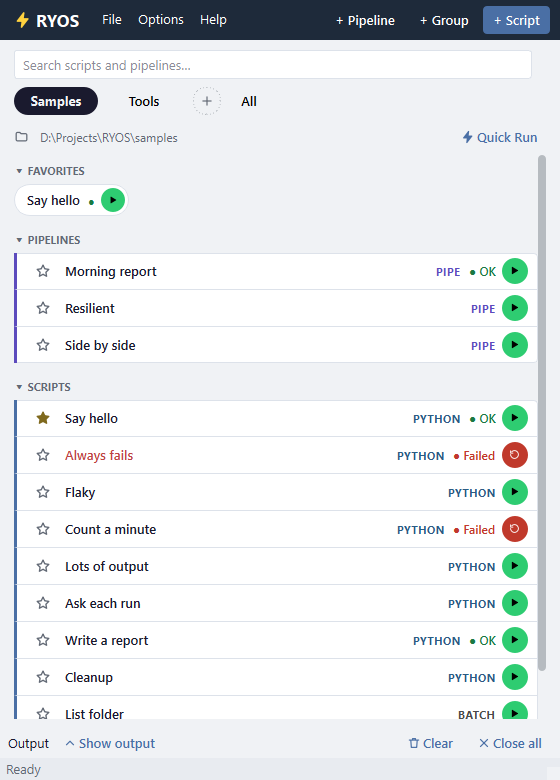
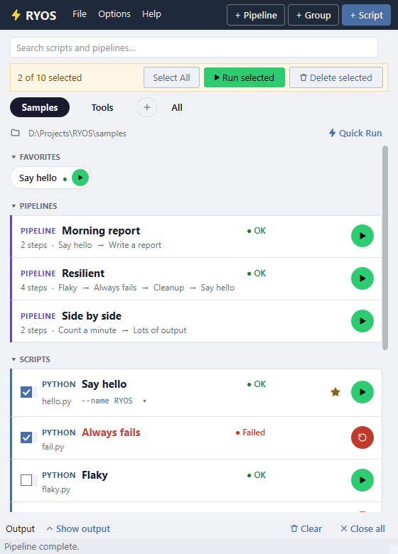
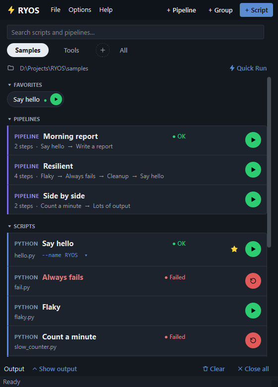

# Tips

## Compact rows

**Options → Options… → Cards → Compact cards** puts each script on one line — star, name, kind, how it last went, Run — so a long list fits. Point at a row for a moment to see its path and parameters.

## Run or delete several at once

**Options → Select scripts** adds a tick box to every script. Tick the ones you want, then **Run selected** or **Delete selected**. **Select All** ticks them all; **Options → Cancel select** leaves the mode.

## Dark, or your own colours

**Options → Appearance…** switches theme. Every colour in RYOS follows the theme — rows, pills, the header and the output alike.

## Small things

- **Highlight a name.** Right-click → **Highlight** colours a row's name, to make one stand out in a long list.
- **Let RYOS pick the interpreter.** Leave **Interpreter** blank: `.py` runs with Python, `.ps1` with PowerShell, and so on. Fill it in only to override.
- **Keyboard.** RYOS starts in the search box: type to filter, **Esc** to clear, **↓** to go into the list. There the arrow keys (and **Home**, **End**, **Page Up/Down**) move between rows, **Enter** runs the row, **F2** edits it and the **Menu** key (or **Shift+F10**) opens its right-click menu, which holds everything its hover buttons do. In select mode, **Space** ticks a row. **Tab** moves between the header, the list and the output; in a dialog **Enter** presses the highlighted button and **Esc** closes it.
- **Keep it running in the tray.** **Options… → Startup & Window → Close to tray instead of exiting** keeps RYOS (and your schedules) running when you close the window.
- **Back up.** **File → Export all groups…** now and then, and your setup is one import away.

---
[← Settings and appearance](11-settings.md) · [Contents](README.md)
