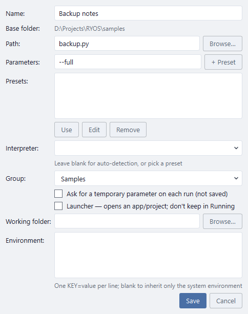

# The command line and AI agents

Everything so far happens in the window. RYOS can also run your scripts and pipelines **without** it: from a terminal, from Windows Task Scheduler or a git hook, or for an **AI agent** such as Claude. The window can stay open while you do; its rows update when something started elsewhere finishes or changes.

## The command line

**Where it is.** In the Windows download, `ryos-cli.exe` sits next to `RYOS.exe` (`RYOS.exe` opens the window and can't print to a terminal). Run from source, it's `uv run ryos` followed by a command. The examples below use `ryos-cli`; from source, type `uv run ryos` instead.

```text
ryos-cli list                         every script and pipeline, how to name each, and what agents may run
ryos-cli run Tools/backup             run a script and show its output as it goes
ryos-cli run Tools/backup --preset full
ryos-cli pipeline Release/ship        run a pipeline, every step
ryos-cli history                      what has run, and who started it
```

**Naming one.** Use the name the row shows, or `group/name` when the same name is in more than one group. RYOS refuses an ambiguous name and lists the ones you might mean. `ryos-cli list` shows each one's full name and its number (`#12`), which also works.

**Parameters.** A script runs with its own parameters, unless you give a saved preset (`--preset LABEL`) or your own: `--params="--fast --verbose"`. Put the `=` in when the parameters start with a dash.

**A few more options:**

| Option | What it does |
| --- | --- |
| `--timeout 300` | Stop the run if it takes longer than 300 seconds. |
| `--json` | Print one result at the end (how it went, exit code, times, the last lines of output) instead of streaming. Handy for scripts that call RYOS. |

**How it went.** The exit code is the script's own: 0 when it passed. RYOS uses a few codes of its own, so a script that calls RYOS can tell them apart:

| Exit code | Meaning |
| --- | --- |
| 1 | The run failed with no code of its own (a failed pipeline, a script that couldn't start). |
| 124 | It ran past `--timeout` and was stopped. |
| 125 | RYOS refused: no such script, an ambiguous name, no such preset, a missing file. |
| 130 | You pressed **Ctrl+C**; the run was stopped first. |

Runs from the command line are in **Run history** like any other; its **BY** column says who started each one (You, Schedule, CLI, Agent…).

**Managing scripts.** You can also add and change scripts without the window — the same rules as the script dialog:

```text
ryos-cli add C:\tools\backup.py --group Tools          add a script (its name is the file name)
ryos-cli edit Tools/backup --params="--fast"           change its parameters, name, group or folder
ryos-cli preset add Tools/backup full --params="--full"
ryos-cli remove Tools/backup                           asks first
```

[RYOS Agent](14-ryos-agent.md) walks through all of them.

**Running on a timer without the window.** RYOS's own [schedules](07-schedules-and-history.md) need the window running (in the tray is enough). To run something when RYOS is closed, point Windows Task Scheduler at `ryos-cli.exe` with `run <group/name>` as the arguments.

## Letting an AI agent run your scripts

An AI agent connected to RYOS can see and run the scripts and pipelines you choose, and read their output, so you can ask it things like *"run the nightly backup and tell me if anything failed"*. It talks to RYOS through **MCP** (Model Context Protocol), the standard way tools like Claude Code and Claude Desktop connect to other programs.

### Choose what it may run

Nothing is available to an agent until you say so. Open a script (or a pipeline) and tick **Available to agents — an AI agent connected to RYOS may run it**, then **Save**. From the command line, `ryos-cli expose Tools/backup on` does the same (it asks you to confirm), and `off` takes it back.



What an agent can and can't do:

- It sees **only** what you ticked. Everything else isn't there at all: it can't list it, run it, or learn its name. Untick a script and the agent loses it at once.
- It runs a script with its own parameters, or one of its saved presets. It **cannot** pass parameters of its own.
- It can stop a run it started, and read a run's output a page at a time.
- A pipeline you tick runs all its steps, whatever the steps' own settings.
- Ticking isn't copied by an import, and a copy or move that makes a script run a different file (into another group's base folder) loses it. Tick it again if you want the agent to have that one too.

Only tick what you'd be happy for the agent to run without asking you first.

> **What the list protects.** It is what Claude Desktop, and any other agent that talks to RYOS only through MCP, can reach. An agent that can also run commands on your PC, such as Claude Code, is not kept in by it: it can start programs itself, including your scripts. Only connect an agent like that if you trust it with your computer.

### Connect Claude

Point Claude at `ryos-cli.exe` in the folder you extracted RYOS to; nothing else needs installing. In the examples below that folder is `C:\Tools\RYOS`.

**Claude Desktop**: open *Settings → Developer → Edit Config* and add RYOS to `claude_desktop_config.json`:

```json
{
  "mcpServers": {
    "ryos": {
      "command": "C:\\Tools\\RYOS\\ryos-cli.exe",
      "args": ["mcp"]
    }
  }
}
```

Backslashes are doubled, because that's how JSON writes `\`. If the file already has an `"mcpServers"` section, put the `"ryos": { ... }` part inside it. Then quit Claude Desktop from the tray icon (closing the window isn't enough) and open it again.

**Claude Code**, in a terminal:

```text
claude mcp add --scope user ryos -- C:\Tools\RYOS\ryos-cli.exe mcp
```

Ask Claude to *"list my RYOS scripts"* to check it's connected.

**Running from source** instead: with [`uv`](https://docs.astral.sh/uv/) and a copy of RYOS (a clone, or the extracted **RYOS-portable.zip**), use `uv` as the command and `run --directory C:\Tools\RYOS --extra mcp ryos mcp` as its arguments.

The agent's runs appear in **Run history** marked *Agent*, and the window's rows update when they finish.

> **Output is just text.** A script's output goes back to the agent as-is. If a script prints something that looks like an instruction, a careful agent reports it rather than doing what it says, but keep that in mind before making a script that reads web pages or e-mail available.

---
[← Tips](12-tips.md) · [Contents](README.md) · [Next: RYOS Agent →](14-ryos-agent.md)
