# Theme gallery — previews

Pick a theme, then download its `.json` and **Import…** it in RYOS
(⚙ → Advanced options → Appearance → Import…).

## Light

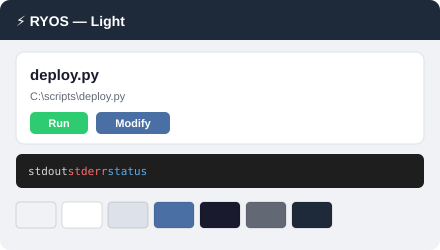

[⬇ Download light.json](light.json)

## Dark

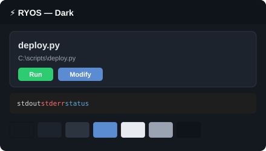

[⬇ Download dark.json](dark.json)

## Forest Canopy

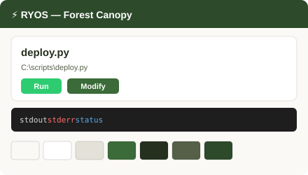

[⬇ Download forest-canopy.json](forest-canopy.json)

## Golden Hour

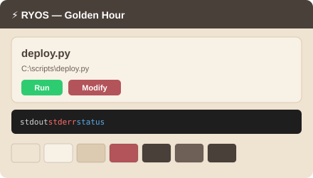

[⬇ Download golden-hour.json](golden-hour.json)

## High Contrast

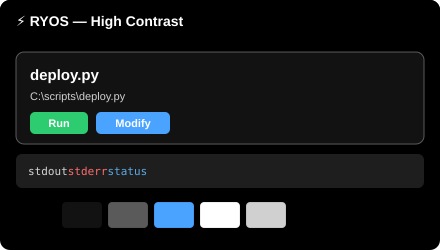

[⬇ Download high-contrast.json](high-contrast.json)

## Midnight Galaxy

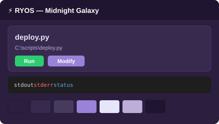

[⬇ Download midnight-galaxy.json](midnight-galaxy.json)

## Nord

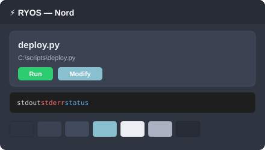

[⬇ Download nord.json](nord.json)

## Ocean Depths

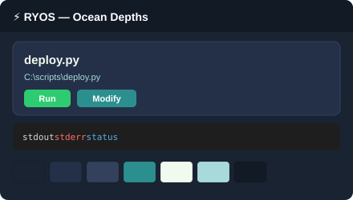

[⬇ Download ocean-depths.json](ocean-depths.json)

## Sepia

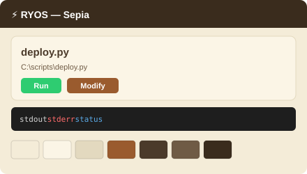

[⬇ Download sepia.json](sepia.json)

## Solarized Dark

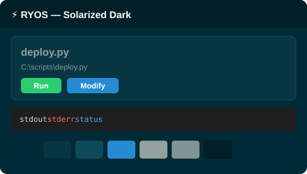

[⬇ Download solarized-dark.json](solarized-dark.json)

## Solarized Light

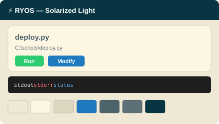

[⬇ Download solarized-light.json](solarized-light.json)

## Sunset Boulevard

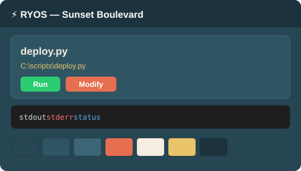

[⬇ Download sunset-boulevard.json](sunset-boulevard.json)

## Tech Innovation

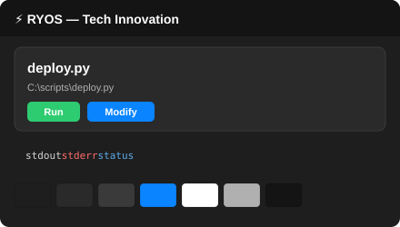

[⬇ Download tech-innovation.json](tech-innovation.json)
